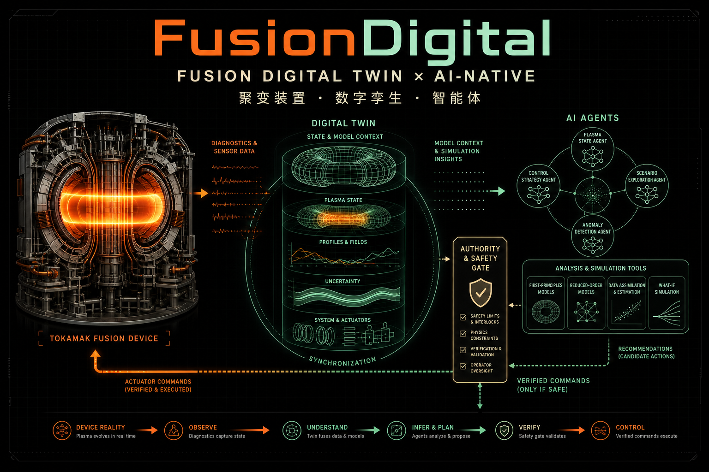

<p align="center">
  
</p>

<h1 align="center">🚀 FusionDigital</h1>

<p align="center"><strong>聚变数字孪生知识与协作平台</strong></p>
<p align="center">Fusion Digital Twin Research Atlas &amp; Collaboration Portal</p>

<p align="center">
  <a href="https://fusiondigital.club/"></a>
  <a href="https://codeup.aliyun.com/fiatlux/DT/FusionDigital"></a>
  
</p>

<p align="center">
  <a href="https://nodejs.org/"></a>
  <a href="https://www.typescriptlang.org/"></a>
  <a href="https://react.dev/"></a>
  <a href="https://vite.dev/"></a>
  <a href="https://workers.cloudflare.com/"></a>
</p>

<p align="center">
  <a href="https://fusiondigital.club/">在线站点</a> ·
  <a href="https://codeup.aliyun.com/fiatlux/DT/FusionDigital">Codeup 仓库</a> ·
  <a href="./docs/PLATFORM_TECHNICAL_ROADMAP.md">平台技术路线</a> ·
  <a href="./CONTRIBUTING.md">贡献指南</a>
</p>

FusionDigital 由新奥聚变人工智能团队维护。项目将聚变物理、工程仿真、集成控制、诊断感知、数字样机、实验数据、证据知识与 AI 原生协作组织在同一个可检索、可引用、可复现的入口中。

它不是一个“万能聚变求解器”，而是连接**知识、数据、模型、实验与工程决策**的公开投影层和协作界面；高保真仿真、实验数据服务与实时控制保持在各自受控环境中，通过版本化合同逐步接入。

> **重要边界**
>
> 本项目是研究与工程协作平台，不是装置保护系统、核安全分析结论或特定装置的实时控制软件。页面中的证据等级只说明公开材料直接证明到哪一步；AI 生成的分析或候选建议不会自动获得装置控制、审核或发布权限。

## 💡 核心理念

- **证据优先（Evidence First）**：结论回链到论文、官方资料、代码、装置和验证语境，明确“已证明、可推断、尚未知”。
- **孪生闭环（Twin as a Loop）**：数字孪生不仅是三维展示，而是设备状态、数据质量、状态估计、模型预测、不确定度和残差更新组成的持续闭环。
- **合同驱动（Contract First）**：装置、炮次、资产、仿真任务、结果、证据和发布均使用可版本化、可校验的对象合同连接。
- **分域治理（Separated Authority）**：公网体验、内网科学计算和实验实时控制具有不同的权限、时延与可靠性要求，不由浏览器或 LLM 越权跨域。
- **可复现发布（Reproducible Release）**：源码、生成数据和公开派生资产可追溯到提交与哈希；大型运行时资产由锁文件声明并独立校验。

## 🎯 总体架构

<p align="center">
  <a href="./public/figures/fusion-twin-ai-native-overview.png">
    
  </a>
</p>

<p align="center"><sub>设备现实 → 诊断观测 → 数字孪生 → 模型与智能体 → 安全门 → 经验证的候选动作</sub></p>

### 🧭 三平面边界

| 平面 | 当前定位 | 主要技术 | 权限边界 |
| --- | --- | --- | --- |
| **公开投影面** | 本仓库已实现 | React 19、vinext、Vite、Cloudflare Worker、D1、Three.js、ECharts | 公开知识、检索、图谱、三维派生物、EFIT 回放、账户与审核控制面 |
| **内网科学平台面** | 目标架构，分阶段接入 | FastAPI、PostgreSQL、S3、MDSplus Gateway、Kubernetes/Slurm、MLflow | 原始实验数据、CAD/CAE、仿真容器、模型训练、结果与 VVUQ |
| **实验实时面** | 独立安全域 | DAQ、PCS、Interlock、RT Linux | 确定性控制、联锁和保护；公网、浏览器与通用智能体不直连 |

当前仓库没有直接连接 MDSplus、NAS、PLM、CAE、FGE/DINA 容器或 PCS。相关能力将通过 `DeviceRevision`、`Shot`、`SimulationRun`、`ResultManifest`、`Evidence` 和 `Release` 等版本化合同接入，而不是把长任务或敏感数据塞入 Web 请求。

## 🔄 关键能力

- **十域知识图谱**：统一组织物理、工程、控制、诊断、能量转化、辅机、数据、人机交互、总体集成与 AI 原生工作。
- **证据检索与引用问答**：确定性站内检索始终可用；配置模型后，以来源白名单和引用约束生成回答。
- **数字样机工作台**：在浏览器中查看 Paramak、EXL-50U 与 ITER 的获准公开派生模型，支持结构树、剖切、爆炸、测量和清单追溯。
- **实验诊断复现**：展示经审核的 EFIT 标量、轮廓、拓扑和时间序列派生物，同时保持原始 G-file、psi 网格和实验档案的受控边界。
- **控制与诊断图谱**：按任务、装置、代码、论文、证据等级和部署阶段双向索引控制与诊断工作。
- **身份与人工治理**：D1 承载账户、角色、配额、审计、研究候选和职责分离审核；接受候选不等于自动发布。
- **可复现研究流水线**：源数据经归一化、去重和审计后生成网页 JSON、CSV、BIB、TypeScript 与 Word 报告。
- **中英双语与主题适配**：关键页面支持中英文切换、明暗主题、响应式布局和键盘访问。

## 🗺️ 功能地图

| 工作面 | 路由 | 内容 |
| --- | --- | --- |
| 总览与路线 | [`/`](https://fusiondigital.club/) · [`/roadmap`](https://fusiondigital.club/roadmap) · [`/platform`](https://fusiondigital.club/platform) | 产品总览、EXL-50U / EHL-2 路线图、三平面目标架构与技术选型 |
| 科学与工程 | [`/physics`](https://fusiondigital.club/physics) · [`/engineering`](https://fusiondigital.club/engineering) | 多尺度物理、集成模拟、工程多物理、验证链与工具图谱 |
| 控制与诊断 | [`/control`](https://fusiondigital.club/control) · [`/diagnostics`](https://fusiondigital.club/diagnostics) | T0–T9 控制任务、DG0–DG11 诊断任务、装置/PCS、证据与孪生接口 |
| 智能与证据 | [`/ai`](https://fusiondigital.club/ai) · [`/search`](https://fusiondigital.club/search) · [`/knowledge-graph`](https://fusiondigital.club/knowledge-graph) | AI 工作目录、确定性检索、引用问答与一至两跳证据关系 |
| 装置与样机 | [`/facilities`](https://fusiondigital.club/facilities) · [`/#prototype-workspace`](https://fusiondigital.club/#prototype-workspace) | 全球装置状态、Paramak / EXL-50U / ITER 目录、三维模型与 EFIT 工作台 |
| 账户与治理 | [`/account`](https://fusiondigital.club/account) · [`/research-review`](https://fusiondigital.club/research-review) | 身份、模型偏好、角色、配额、审计、研究候选与人工审核 |

## 🔥 快速上手

### 1. 环境要求

- Git 2.40+
- Node.js `>=22.13.0`
- npm（随 Node.js 安装）
- Python 3（仅研究数据和 Word 报告工作流需要）

### 2. 通过 SSH 克隆并启动

```bash
git clone --branch main --single-branch git@codeup.aliyun.com:fiatlux/DT/FusionDigital.git
cd FusionDigital
npm ci
npm run assets:verify:tracked
npm run dev
```

终端会打印本地访问地址。默认开发不需要下载 ITER 高清资产，也不需要任何模型 API Key。

### 3. 按需补齐能力

```bash
# 完整恢复 ITER 18 个高清运行时分片，并校验字节数与 SHA-256
npm run assets:hydrate
npm run assets:verify

# 初始化并核验本地 D1（账户/审核等能力的本地开发）
npm run db:local:migrate
npm run db:local:verify

# 提交前质量门：lint + build + 串行测试
npm run check
```

完整复现流程见[运行时资产获取与校验](./docs/ASSET_BOOTSTRAP.md)和[本地部署手册](./docs/LOCAL_DEPLOYMENT.md)。

## 🧰 常用工作流

| 目标 | 命令 |
| --- | --- |
| 开发 / 构建 / 启动 | `npm run dev` · `npm run build` · `npm run start` |
| 统一质量门 | `npm run check` |
| 查看与校验公开资产 | `npm run assets:status` · `npm run assets:verify:tracked` |
| 补齐并校验完整资产 | `npm run assets:hydrate` · `npm run assets:verify` |
| 重建 AI 研究数据 | `npm run research:ai` · `npm run research:audit` |
| 重建控制研究数据 | `npm run research:control` · `npm run research:control:audit` |
| 重建诊断研究数据 | `npm run research:diagnostics` · `npm run research:diagnostics:audit` |
| 重建图谱与检索索引 | `npm run research:graph` · `npm run search:build` |
| 生成研究报告 | `npm run research:report` · `npm run research:control:report` · `npm run research:diagnostics:report` |

生成 Word 报告前安装 Python 依赖：

```bash
python -m pip install -r requirements-research.txt
```

研究源数据是事实维护入口。执行生成命令后必须同时审查并提交源数据与生成文件，避免网页、索引和报告分叉。详见[内容维护手册](./docs/CONTENT_MAINTENANCE.md)。

## 🗂️ 项目结构

```text
app/                          页面、组件、国际化与服务端接口
worker/                       Cloudflare Worker 入口与受控资产路由
db/                           D1 schema、查询与领域模型
drizzle/                      版本化数据库迁移
public/                       公开报告、图像、JSON/CSV、三维与 EFIT 派生物
assets/                       运行时资产锁；不存放源 CAD 或源实验数据
research/
  ai-native/                  AI 原生研究源数据
  control/                    控制任务、PCS 与装置档案
  diagnostics/                诊断任务、装置档案与研究底稿
  3d/                         公开三维演示模型的可复现生成说明
scripts/
  research/                   数据生成、审计、索引与报告脚本
  assets/                     外置资产获取、校验与镜像暂存工具
tests/                        SSR、数据合同、资产、安全边界与 UI 测试
docs/                         架构、复现、平台路线和协作手册
.openai/hosting.json          Sites 项目标识与逻辑资源声明
```

架构入口：[项目架构](./docs/ARCHITECTURE.md) · [平台技术路线](./docs/PLATFORM_TECHNICAL_ROADMAP.md) · [知识对话](./docs/KNOWLEDGE_CONVERSATION.md) · [LLM 配置](./docs/LLM_PROVIDER_CONFIGURATION.md)

## 📝 项目蓝图（Roadmap）

- [x] 公开知识域、装置目录、证据检索和知识图谱
- [x] Paramak / EXL-50U / ITER 浏览器数字样机与资产清单
- [x] 公开 EFIT 派生数据的分片交付、回放和拓扑展示
- [x] D1 账户、角色、配额、审计、研究候选和人工审核
- [x] 版本化研究数据、报告、资产锁和发布质量门
- [ ] 统一 `DeviceRevision`、`Shot`、`ArtifactManifest`、`SimulationRun` 与 `ResultManifest` 合同
- [ ] MDSplus、NAS、对象存储、PLM/CAD 与科学计算的只读适配器
- [ ] FGE / DINA / MEQ 等模型的容器化 Run API、结果目录和 VVUQ 门禁
- [ ] 实验前场景验证、SIL/HIL 与只读影子孪生
- [ ] 经独立验证、审批、签名与回滚保护的受控发布链

更完整的阶段、技术栈和验收标准见[整体技术路线图](./docs/PLATFORM_TECHNICAL_ROADMAP.md)。

## 🔐 数据与安全边界

- Git 只保存获准公开的源码、知识数据、报告与浏览器运行时派生物。
- 原始 EXL-50U / ITER CAD、STEP、B-Rep、PMI、尺寸、公差和完整装配元数据留在受控工程系统。
- 原始 EFIT 档案、G-file、psi 网格、未脱敏诊断与实验数据留在受控实验数据系统。
- ITER 高清教育可视化的 18 个 GLB 分片由 `assets/runtime-assets.lock.json` 锁定文件名、字节数和 SHA-256，并在 Git 之外分发。
- 任何模型、智能体或网页建议都不能绕过装置控制器、联锁、保护系统、人工审批或独立 VVUQ。
- 禁止提交账号、令牌、Cookie、私钥、内部下载地址、未脱敏日志和未经授权的第三方材料。

详细规则见[贡献指南](./CONTRIBUTING.md)和[EXL-50U 公开派生物安全说明](./docs/EXL50U_PUBLIC_DERIVATIVE_SECURITY.md)。

## 🚢 托管与发布

- 正式站点：[https://fusiondigital.club/](https://fusiondigital.club/)
- 团队协作仓库：[Codeup / fiatlux/DT/FusionDigital](https://codeup.aliyun.com/fiatlux/DT/FusionDigital)
- 生产托管：OpenAI Sites（Cloudflare Worker 兼容运行时 + D1）

`main` 是可发布基线。发布维护者只部署已经推送、完成资产校验并通过质量门的同一提交；Sites 的短期源凭证不写入远端地址、脚本或文档。公网构建不打包本机 hydration 目录，避免突破静态归档上限；内网自包含部署则先补齐并校验运行时资产。

## 🤵 维护者

### 🏆 Owners

- 新奥聚变人工智能团队（ENN Fusion AI Team）

### ✉️ Contact

- [tianshao1992@gmail.com](mailto:tianshao1992@gmail.com)

## 🎁 参与贡献

欢迎提交科学内容、数据条目、代码实现、可视化、测试、文档和问题报告。

1. 从最新 `main` 创建短生命周期分支。
2. 一个 Pull Request 聚焦一个主题，并说明证据来源、生成文件、验证结果和已知局限。
3. 软件变更由软件维护者审核；科学结论变化同时由相应领域专家审核。
4. 提交前至少运行 `npm run assets:verify:tracked` 和 `npm run check`。

推荐使用 Conventional Commits：

```text
feat(prototype): add reviewed device manifest
content(control): update task evidence
docs: clarify runtime asset workflow
fix(search): preserve citation boundaries
```

完整流程与检查清单见[贡献指南](./CONTRIBUTING.md)。

## 📄 许可证与数据权利

当前仓库尚未声明开源许可证。除非项目负责人另行书面确认，代码、报告、图像和调研数据均按团队协作资料管理；外部复用前须分别核对原始论文、第三方图片、商业软件和装置数据的许可条件。

---

<p align="center"><strong>FusionDigital — 让聚变模型、实验与工程经验真正互相理解。</strong> ⚛️</p>
