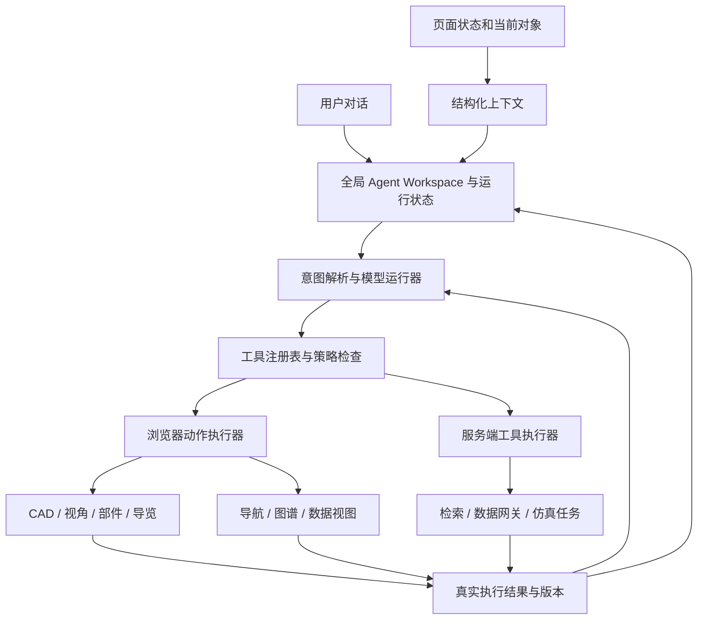

# FusionDigital 全站原生智能体与 EXL-50U 对话漫游规划

日期：2026-09-10。状态：实施规划，未修改产品代码、资产、身份策略或部署。

## 1. 建议与本次增量

把现有 Agent Workspace 升级为全站统一的操作入口：用户表达意图，智能体读取当前页面的结构化状态，调用受控动作，页面执行后返回实际结果。CAD 是第一条完整验收链路，随后复用同一机制连接知识检索、FusionData、EFIT 与仿真结果。

本规划承接 [Agent Workspace 架构](AGENT_WORKSPACE_ARCHITECTURE.md)、[平台技术路线](PLATFORM_TECHNICAL_ROADMAP.md) 与 [CAD 包合同](CAD_DEMO_AND_EXL_SWAP.md)，具体增加：

1. 页面上下文、对象语义、浏览器动作与结果回执的统一合同。
2. EXL-50U 总装视角漫游、公开部件语义与爆炸导览的独立交付门槛。
3. 全局任务生命周期，以及香港入口原生模型服务的演进路径。
4. 可直接拆分开发的工作包、验收场景与分阶段范围。

保留现有 React / Three.js、知识检索、供应商适配器和全站侧栏。第一轮不用引入多智能体框架、远程桌面控制或新三维引擎。网页漫游属于浏览器可视化；桌面 CAD 原生编辑、装配约束求解与工程操作另列范围。

## 2. 核验基线与真实缺口

本地仓库：`D:\Code\FusionDigital`，分支 `master`，HEAD `ec9cd7247308af8ffd9bcbcc68c53e0533e88e66`。Codeup 已实时获取到 `19af57321ecfac53bf497d6cd344b87d16e38f53`，新增两次 FusionData 离线快照/派生信号更新，未改变本规划涉及的 Agent/CAD 核心文件。GitHub 两次获取失败，缓存引用仍为本地 HEAD；不能据此判断 GitHub 当前远端 SHA。未合并、切换分支或改变现有用户文件。

以下为静态代码和合同核验，未进行本次浏览器、GPU、线上部署或完整测试验证。

| 范围 | 当前已存在 | 本轮需要补齐 |
|---|---|---|
| 全站入口 | `app/layout.tsx:59` 已挂载唯一 AgentWorkspace | 各页面统一注册状态、对象与可执行动作 |
| 侧栏接口 | `AgentWorkspace.tsx:42` 仅有 open / close / isOpen；有页面路径、标题和局部 focus 上下文 | 页面状态持续同步、跨页面对象关联、动作分发 |
| 任务运行 | 关闭侧栏会卸载 KnowledgeChat，并触发请求取消 | 将运行状态上提到全局 provider；折叠和取消成为两个动作 |
| 模型交互 | `/api/agent/turns` 复用 `/api/ask`，完整校验后分段发送 SSE | 工具调用、浏览器回执、后续模型轮次；持久运行后再做断线恢复 |
| 香港入口 | `public-anonymous` 下确定性检索，`modelGateway=false` | 新的模型运行与访问策略；不能仅填写 API Key 或删除模式判断 |
| 通用 CAD | 预设视角、自由拖拽、显隐/隔离、透明度、剖切、相机快照与受控状态桥 | 通用 CAD controller、相机平滑过渡、爆炸状态和导览播放器 |
| 简化 EXL 模型 | `exl50u-interactive` 有 12 个系统/12 个公开 partId | 可作为部件命令首批验收对象；不能替代总装验收 |
| EXL 总装 | 20 个匿名高精度运输分片、一个公开可视化根 | 公开语义分组、实例绑定与经审核的导览内容 |

旧架构文档中的某些界面描述已落后于代码，例如“三个独立视图”；本规划以当前实现为基线，后续实施时同步修正文档。

### EXL 总装资产必须单独说明

当前 `public/models/exl50u-general-assembly-v1/model-manifest.json` 为 schema 1.5：

- 公开资产为匿名、非工程权威的可视化派生，不含原始 CAD、BOM、源装配树、PMI 或尺寸权威。
- 20 个分片合计 270,978,652 bytes，约 271 MB；它们是运输分片，不能解释为 20 个工程系统。
- manifest 声明 `decodedGpuBytes=791208298`、800 个 draw calls 和约 3264 万场景三角形。这些是资产指标，不是实测浏览器峰值内存或帧率。
- 覆盖记录是 9059 个源 occurrence 中 8963 个可渲染 occurrence，另有 96 个跳过项。`highMissingOccurrences=0` 指可渲染集合的派生覆盖，不代表原始总装所有实体都已完整显示。
- 当前加载器串行获取并解码全部分片后才组装场景；没有已发布的轻量首屏包或按视野加载机制。
- 当前总装隐藏部件树，并跳过部件到渲染节点的映射，因此没有可用的部件选择能力；不能靠前端猜测或视觉模型识别，恢复原始工程部件身份。
- 总装当前不允许模型叠加，也未声明物理/诊断叠加能力；简化包上的 EFIT、传感器与诊断端口映射不能直接移用到总装。

`docs/CAD_DEMO_AND_EXL_SWAP.md` 仍残留 schema 1.4 和“21 个 GLB/外置资产文件”表述；本规划采用当前 manifest/代码的 20 个 high-detail 分片合同，此数量不包含仓库内的 manifest/notice。实施时应先修正这一文档差异，不借机改变已发布资产。

## 3. 用户体验：先让对话真正改变当前画面

侧栏继续随全站存在，CAD 页面增加简短的当前装置、当前选择和操作反馈。提供“停止”“上一步”“恢复装配”，鼠标和键盘始终可接管。

| 用户表达 | 页面应执行 | 前置条件 |
|---|---|---|
| “打开 EXL-50U 总装，从顶部看” | 导航到数字样机，选定总装，等待 ready，应用顶部视角 | 当前总装即可实现 |
| “绕装置向右转 30 度，靠近一点” | 以显示坐标/当前观察目标为基准平滑移动相机 | 定义角度正方向、目标与缩放上下限 |
| “剖开一点，让我看内部” | 调整显示剖切平面，保留一键恢复 | 当前总装即可实现；不宣称工程剖面测量 |
| “只看真空室，把其余部分淡化” | 解析唯一公开 partId，聚焦并改变其他部件可见性 | 简化包已可验证；总装须有审核后的语义包 |
| “把这些部件展开到 40%” | 按发布的爆炸配置改变显示实例变换 | 有独立可操控的公开部件和爆炸配置 |
| “带我浏览整个装置，先整体再内部” | 运行可暂停、可跳转的分站导览 | 当前总装先做视点导览，语义包就绪后增加部件讲解 |
| “这个部件对应哪些资料？” | 保持当前选择，打开经映射的知识条目 | 有经审核的实体映射和引用 |
| “把刚才的视角保存，回到炮次页面” | 保存本地视角书签，导航并带回有效装置上下文 | 私人跨设备保存另需服务端身份与持久化 |

“这个”“刚才”“再近一点”由最近的真实选择、动作回执和相机状态解析。一个词对应多个部件时显示候选让用户点选；没有公开映射时准确说明并提供已有选项。

验收演示建议分为两条：总装完成打开、转向、剖切、导览、恢复；简化 EXL 包完成部件选择、隔离、透明度和撤销。第二阶段在新的总装语义包上重新执行部件验收，才称总装部件漫游完成。

## 4. 统一架构与原生接入方式

模型负责理解、选工具和解释结果；Three.js、React 与服务端领域 API 执行动作。渲染动画由浏览器逐帧计算，不让模型逐帧生成坐标。

### 4.1 四个共享合同

| 合同 | 最小内容 | 作用 |
|---|---|---|
| PageContext | routeId、pageInstanceId、locale、当前实体、contextRevision、可用能力 | 知道用户当前在哪、对象是谁、信息是否过期 |
| ViewerState | viewerId、packageId、manifestHash、camera、selection、visibility、clipping、explode、tour、sceneRevision | 鼠标和对话共用真实状态 |
| ToolDefinition | name、schemaVersion、input/output schema、执行位置、风险类别、前置条件、超时、可撤销性 | 确定允许做什么及如何校验 |
| ToolResult | runId、actionId、status、before/after revision、applied state、error、source refs | 区分已规划、正在加载、已应用、失败与已取消 |

上下文只包含相关元数据和有界摘要，不自动上传整个 DOM、CAD 文件、全部信号数组或表单。先查询目录，再按目标 ID 读取局部对象；大型模型只在浏览器/资产服务处理。

CAD 中的稳定 ID 需要分开：装置身份、几何包版本、语义实体、公共部件、装配实例和渲染实例。运输分片名、Three.js 随机 UUID、展示名称都不能充当稳定工程 ID。跨模型和炮次关联必须通过版本化映射，不能根据“都是 EXL-50U”自动假定同一几何基线。

### 4.2 工具的首批范围

| 领域 | 建议工具族 | 执行位置 |
|---|---|---|
| 站内 | `site.navigate`、`site.get_context`、`knowledge.search` | 导航/上下文在浏览器，检索通过现有服务 |
| CAD | `cad.get_state`、`cad.list_parts`、`cad.set_view`、`cad.focus` | 浏览器 controller |
| CAD 显示 | `cad.set_visibility`、`cad.set_opacity`、`cad.set_clip`、`cad.restore_state` | 浏览器 controller |
| 导览 | `cad.set_explode`、`tour.start`、`tour.pause`、`tour.next`、`tour.stop` | 浏览器 controller，按 manifest 能力启用 |
| 数据 | `data.open_shot`、`data.select_signals`、`data.set_time_window`、`data.read_summary` | 浏览器适配器 + 有界只读数据接口 |
| 仿真 | `simulation.open_run`、`simulation.compare_runs` | 先只读；提交作业作为后续单独能力 |

这些名称是规划中的内部命名，供应商适配器可映射为兼容的函数名。每轮只提供当前任务相关的工具，减少选错对象和无关调用。

视角、显隐、剖切等本地可逆显示操作可直接执行并提供撤销；提交计算、修改共享数据和对外发送分别采用相应权限、预览和确认。浏览器声称成功只能证明本地展示结果，不能作为服务器数据已写入或工程状态已修改的凭据。

### 4.3 执行闭环必须处理的情况

1. 接收动作时固定 `viewerId + packageId + manifestHash + expectedRevision`，拒绝对旧页面、旧模型继续执行。
2. “打开模型再看顶部”是顺序动作：导航完成、页面注册、资产 ready 后才定位；载入过程返回进度，失败时返回真实失败。
3. 同一 viewer 的变更串行执行。新对话或鼠标接管取消尚未完成的旧动画，并把当前实际姿态作为新起点。
4. `actionId` 去重。重复 SSE、重连与模型重复调用不累计旋转，不重复提交任务。
5. 复合显示动作预先校验；中途失败则恢复快照或报告精确的部分完成状态。相机到位、部件状态写入并完成下一次渲染后，再返回应用成功。
6. 每个动作设置超时与取消。撤销记录前一状态，不用“反向再转 30 度”近似恢复。
7. 导览被打断时保存站点和姿态，继续时重新检查模型版本和资源准备状态。

### 4.4 SSE、模型与持久任务如何衔接

保留现有 `/api/ask` 检索兼容路径，给 Agent 协议增加独立版本和 `tool.proposed / tool.started / tool.completed / tool.failed / run.cancelled` 事件。不要把未经校验的普通回答文本当命令执行。

浏览器工具通过绑定当前 run/session 的结果接口回传 `actionId` 与状态；服务端重新验证运行所有权、参数、时序和结果体。模型调用等待对应结果后再续轮。原有的最终答案 schema、引用验证与工具事件分别校验；工具执行成功不代表知识解释已获得引用支持。

短期本地展示动作由全局 provider 维护，关闭 dock 后仍可完成；服务端运行、跨刷新恢复与重连回放需要真实 repository/事件记录，不能把进程内 Map 当持久线程。将消息/run 存 PostgreSQL 等持久存储，SSE 只传输事件；用单调序号和游标恢复，浏览器卸载后未开始的本地动作不得悄悄执行。

供应商能力表明确 `toolCalling / structuredOutput / streaming`。不支持工具的模型回退到普通问答或本地受限指令，不从自由文本提取代码运行。

### 4.5 MCP 与当前外部智能体的位置

网站自己的原生 Agent 首期直接调用内部工具注册表即可，MCP 是后续给 Codex 等外部客户端复用能力的可选适配层。仅配置 MCP 并不会让模型自然知道当前浏览器选中的部件，也不会自动执行 Three.js 动画。

如果“当前智能体”还包括本机 Codex，后续可增加一个用户主动配对的浏览器会话桥：限定 tab/viewer、短期连接授权、动作白名单、断开即撤销。外部客户端经过同一执行器和结果合同；模型密钥、私人 CAD 与任意页面执行权限不交给浏览器插件。

这种会话桥与网站访客使用的原生 Agent 是两个入口，可以共享工具合同。第一阶段优先完成网站内闭环。

## 5. EXL-50U 总装的三层建设

### A. 当前匿名包上的全装置视角导览

直接复用当前总装，加入平滑视角、观察目标、相机书签、剖切预设与 6–10 个经人工校核的外观/内部视点。支持停留、上一站、下一站、随时接管和恢复全貌。

当前没有公开语义的目标不能以“找到真空室”报告成功。可以采用“顶部视点”“侧面剖切视点”等可验证的显示名称。漫游默认采用轨道观察和有限路径导览；自由步行、碰撞避让和 VR 后置。

### B. 公开语义总装包

建立新的、经审核的公开派生版本。先覆盖经批准的 8–12 类可识别区域或部件，再视资料许可扩展；数量是实施目标，不是已有公开资产事实。

建议 `public-assembly-index` 包含 publicPartId、公开名称/别名、公开层级、装配实例绑定、显示包围盒、允许动作、讲解引用、焦点视图、explosionProfileRef。私有 BOM、原始 ID 和命名映射保存在受控导出环境，仅投影获准的公开字段。

如保留匿名渲染节点，需新增经审核的公开渲染 ID 或 sidecar 映射；映射可能跨分片并涉及 instancing。一个文件不是一个部件，一份几何定义也可能有多个独立位置的装配实例。拾取、隐藏与爆炸要作用于实例集合，不能粗暴移动整个运输分片。

每次包发布锁定几何摘要、语义版本、映射摘要和导览版本；执行缺失、重复、跨部件混入及匿名信息泄露检查。公开语义不是自动恢复原始装配树，是否能公开具体名称仍依资产发布流程判断。

### C. 爆炸与分站讲解

为获准部件配置显示层原始变换、爆炸方向、距离、阶段、组关系和查看姿态。显示变换始终从基线计算：`M_display = T_explode(f) × M_assembly`，坐标系与乘法约定在 renderer 合同中固定，`f=0` 恢复原始装配。

先做经人工审核的径向/轴向展示展开，支持 0–100% 插值和分组展开。部件质心相近时使用配置向量，避免随机抖散；动画用 quaternion 插值与有界 easing。模型只给出目标部件和展开程度，不生成任意矩阵、脚本或拆卸顺序。

实例变换更新后同步包围盒、拾取加速结构和显示状态；不修改底层权威几何。爆炸是展示效果，不表示碰撞可行、维护拆装路径或工程装配约束。爆炸状态下禁用依赖原始物理坐标的测量、EFIT/诊断叠加，或仅在经过验证的专门映射下使用。

导览脚本保存步骤 ID、模型/语义版本、目标对象、视角、显隐、剖切、爆炸程度、讲解来源和可跳转后继。讲解“部件功能”与“当前画面状态”分开取证；无来源内容明确未知。

## 6. 大型 CAD 资产与交互性能

在当前 271 MB 总装未完成下载前，不能承诺秒级全装置首屏。按 100 Mbps 理想链路仅传输就约需 21.7 秒，尚未计入共享带宽、网络与解码；这只是容量估算，不是线上测速。

先在当前包实现性能埋点：请求/校验/解码耗时、首个可交互时刻、帧时间分布、长任务、取消与模型切换后资源释放。记录浏览器、GPU、屏幕分辨率、DPR、网络和冷/暖缓存条件。

新资产版本再考虑经审核的全装置低 LOD 首屏、按区域/视点请求高 LOD、Worker 解码、缓存与显存预算、低 DPR 和语义组可见性裁剪。现行合同没有发布 preview/fallback，不能把私有 QA preview 直接启用为公开首屏；发布新 LOD 前须更新 schema、匿名投影和逐资产 QA/锁文件。

加载过程中明确显示“部分加载”，全部目标资源经校验后才能报告完整。低内存或窄屏设备维持明确能力提示；没有合格轻量包时不假装已完成总装漫游。WebGL context loss、内存不足和分片错误都要给出可恢复路径。

建议验收目标（需由选定测试设备校准）：已 ready 状态本地命令接收/开始回执 p95 ≤100 ms、普通视角动画约 0.5–1 秒、桌面操作期间帧时间 p95 ≤33 ms。应用完成回执必须等待动画与实际渲染完成。模型理解延迟、资产首载和动画时间分别测量，不混成一个成功指标；达不到总装性能目标时必须明确限制或完成 LOD 工作。

## 7. 全站原生能力如何逐步扩展

| 页面/对象 | 第一批动作 | 返回的可验证上下文 |
|---|---|---|
| 数字样机/CAD | 装置切换、视角、剖切、公开部件操作与导览 | 包版本、选择、视角、动作结果 |
| 检索/知识图谱 | 打开条目、应用筛选、聚焦实体与关系 | 条目 ID、实体 ID、来源引用 |
| FusionData | 选择现有炮次、信号、时间窗、只读对比 | 装置、炮号、信号路径、单位、时间基准、snapshot/revision |
| EFIT/诊断视图 | 选择有效切片、时间、当前已支持的图层 | reconstruction/measurement 身份、坐标版本、缺失状态 |
| 仿真结果 | 打开已有 run、选择输出、比较兼容结果 | engine/model、runId、输入版本、simulated 标识 |
| Canvas | 从当前选择生成有来源的本地摘要或导览说明 | 来源、版本、当前仅本地/未来已持久化状态 |

前两批只读与本地显示即可覆盖大部分全站浏览。“选择某炮次”不能暗示公网实时连接 MDSplus；当前离线 snapshot、重建结果和 simulation-run 各自保留身份。知识解释从元数据与引用获得，数值查询走有界 API，不让模型从图像猜测科学数值。

全站上下文需要统一 entityRef 和 relation registry，但先用类型化目录和显式映射就够用，不必为第一批交付建设复杂知识图数据库。关系未登记时说明未关联，不能把同名对象强行链接。

## 8. 香港原生模型：需要产品运行模式的明确演进

现行 `AGENTS.md` 与生产合同要求香港 `public-anonymous`，并屏蔽身份/账户/写能力；当前代码也直接回退到确定性检索。因此，模型工具调用不能靠添加 key、嵌入聊天 iframe 或切换 UI 开关上线。

分三种可交付状态：

| 状态 | 可以实现 | 边界 |
|---|---|---|
| 保持当前香港合同 | 浏览器内受限中文指令解析、预设导览、全部本地可逆显示动作 | 界面明确“本地指令”；不宣称开放式模型推理 |
| 当前允许模型的工作区演进 | 先在已有可信身份环境接通工具闭环，复用全站 adapters | 仍须核验实际供应商配置/权限；不称香港原生已完成 |
| 香港全站原生模型目标 | 同站浏览 + 可认证的智能体会话，服务端 AI Gateway/Tool Broker/持久线程 | 需先审核并版本化修改运行模式、身份、API 和发布合同 |

推荐最终产品形态：公开内容继续直接浏览；需要开放式对话、长期会话和个人资源时，在本站完成认证并使用同源 Agent BFF。OIDC、服务端会话和资源所有权沿用既有架构方案。工程私有资源通过独立授权网关访问，不进入公开资产目录。

这是未来合同变更建议，本次不改现行规则。生产域名和香港源站拓扑无需因智能体改动迁移到 Sites；正式发布仍须满足双远端、香港和 Sites 同一源码 SHA 的既有门禁。

后端先采用一个独立 Agent 服务或明确边界的模块即可：BFF 负责会话与流式 API，Gateway 负责供应商适配/预算，Tool Broker 负责权限与执行，PostgreSQL 负责线程/run/事件。附件存储、队列、外部网页抓取与多模态按真实需求后置，不作为本地 CAD 指令的前置工程。

供应商根据部署地点、可用性、工具调用能力和数据分类选定，密钥仅服务端保存。无需为本规划锁定某个最新型号；保留现有供应商适配层并实测目标组合。

## 9. 建议交付顺序与工作量

估算假设：2 名前端/三维开发、1 名后端开发，CAD/装置负责人每周参与语义审核。以下是工程估算，不含资料授权、生产规则审议、账户开通及不可预期的资产返工等待。

| 工作包 | 建议时间 | 交付与退出标准 |
|---|---|---|
| P0 合同与基线 | 第 1 周 | context/action/result schema；能力矩阵；总装性能基线；公开语义候选范围 |
| P1 CAD 对话闭环 | 第 2–3 周 | 全局 run store、CAD adapter、本地指令、总装视角/剖切导览、撤销；简化包部件命令 |
| P2 总装语义与爆炸 | 第 2–5 周，与 P1 并行 | 经审核的新语义包、实例映射、分组爆炸、6–10 站总装导览；覆盖/恢复/视觉验收 |
| P3 模型原生工具回路 | 第 3–6 周，取决于运行模式决策 | 服务端模型→工具→浏览器回执→续轮；配额、取消、身份/持久化分级可用 |
| P4 全站连接与优化 | 第 6–8 周 | 检索/图谱、FusionData、只读结果适配器；跨页连续任务；性能和失败恢复验证 |

第一阶段 2–3 周可得到对话操作的演示版本；完整总装语义与香港原生模型取决于各自门槛，不能用该演示替代完成验收。只有 1 名开发时应按工作包顺序滚动估算，不沿用上述并行日历。

建议最先落地的 5 个可审查改动：

1. 新增 `app/agent/context-registry.ts`、`tool-registry.ts` 与版本化动作合同。
2. 将对话/run 生命周期从 KnowledgeChat 上提，dock 关闭仅改变可见性，取消另设按钮。
3. 从现有受控 viewer 状态接口提取通用 `cad-controller`；先接总装视角、剖切和状态读取。
4. 增加最小 `TourPlayer` 与固定总装视点，不依赖模型也能播放和验收。
5. 以简化 EXL 包验证部件指令，同时为总装准备独立的公开语义投影候选。

以上新增路径是建议，不代表文件已经存在。修改通用 viewer 时保留现有诊断受控状态桥的兼容性，避免重建/重新下载大型模型。

## 10. 验收与实施边界

| 验收组 | 必须通过的场景 |
|---|---|
| 对话执行 | 打开总装→等待 ready→顶部→旋转→剖切→恢复；回执与真实状态一致 |
| 部件语义 | 同名候选、未知部件、跨分片实例、多实例选择；运输分片不能被当作工程部件 |
| 爆炸 | 0%/40%/100% 展开、往返恢复、组展开、鼠标接管；与原始变换比较，无累计漂移 |
| 连续任务 | 关闭/重开 dock、切页、切模型、连发命令、断网/重试；不误操作旧 viewer |
| 模型回路 | 参数不合格拒绝、失败/超时回传、去重、工具步数与成本限制；未成功不说“已完成” |
| 科学关联 | 无效炮号、缺失信号、单位/时间窗冲突、几何版本不匹配；不补零或混淆数据身份 |
| 大型 CAD 性能 | 冷/暖缓存、指定桌面与低内存设备、显存/长任务、取消后资源释放、WebGL context loss |
| 发布隔离 | 公开 manifest 无私有映射/原始 CAD；现有匿名、资产摘要、Range 与双端发布门禁继续有效 |

测试采用领域 controller 测试、协议集成测试和真实浏览器行为验证。相机/选择/显隐必须从实际状态断言，爆炸与导览补充关键视图检查；仅关键词识别成功或模型回复“已完成”不算验收。

本次仅新增规划文档。未修改代码、资产、身份模式、AGENTS、DNS，未提交、推送、部署；未实测现网、GPU 或模型执行效果。后续开发应先在隔离工作树纳入 Codeup 更新并重新核对 GitHub，再按上述工作包推进。

## 11. 当前依据

项目证据入口：

- [根布局](../app/layout.tsx)、[AgentWorkspace](../app/components/agent-workspace/AgentWorkspace.tsx)、[KnowledgeChat](../app/components/knowledge-chat/KnowledgeChat.tsx)。
- [能力声明](../app/agent/capabilities.ts)、[当前事件合同](../app/agent/contracts.ts)、[持久化占位](../app/agent/repository.ts)、[turn 路由](../app/api/agent/turns/route.ts)、[ask 路由](../app/api/ask/route.ts)。
- [CAD viewer](../app/components/TokamakCadViewer.tsx)、[模型加载器](../app/components/device-viewer/componentModelLoader.ts)、[总装 manifest](../public/models/exl50u-general-assembly-v1/model-manifest.json)、[简化 EXL manifest](../public/models/exl50u-interactive/model-manifest.json)。
- [既有 Agent 架构](AGENT_WORKSPACE_ARCHITECTURE.md)、[平台路线](PLATFORM_TECHNICAL_ROADMAP.md)、[公开派生安全边界](EXL50U_PUBLIC_DERIVATIVE_SECURITY.md)。

2026-09-10 实际读取的 OpenAI 官方文档：

- [Function calling](https://developers.openai.com/api/docs/guides/function-calling/)：模型提出调用，应用执行，通过 `function_call_output` 和 `call_id` 返回结果，再继续模型轮次。`strict: true` 要求 object 禁止额外字段、properties 全部 required；可选值用 nullable 表达，仅支持部分 JSON Schema。运行时权限、ID、数值范围和成功状态仍由应用验证。
- [MCP and Connectors](https://developers.openai.com/api/docs/guides/tools-remote-mcp/)：MCP 可提供外部工具并限制 `allowed_tools`。网站仍需实现上下文和动作执行器；“不会自动连接前端 UI”是根据工具职责提出的架构判断。

未核验具体模型资格、价格、供应商区域或账号可用性；相关选择留在实施时实时确认。
