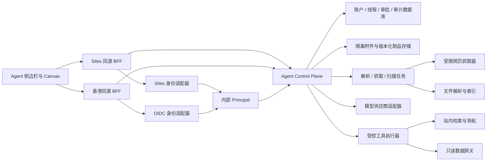

# FusionDigital Agent Workspace 架构与安全边界

> 状态：设计提案，尚不代表生产能力已经启用。
>
> 本文定义侧边栏持续对话、多模态输入、网页上下文、Canvas、工具调用和双入口身份的目标合同。任何上线实现仍须遵守生产发布门禁；在身份、数据和供应商合规验收完成前，香港入口继续保持当前公开匿名模式。

## 当前落地切片

本次改造已经交付可运行的第一层产品外壳，但没有把目标能力伪装成已完成：

- 根布局只挂载一个全站 Agent Workspace；桌面端是右侧 dock，中屏是 overlay，手机端是全屏工作区。
- 对话、上下文和 Canvas 是三个独立视图；现有站内证据问答被迁入 dock，并继续使用有界本地连续会话。
- 检索页会传入查询与筛选条件，知识图谱会传入当前实体和描述，其余页面自动传入当前路径与标题。
- `/api/agent/capabilities` 返回不含凭据的运行能力。Sites 与 standalone public profile 在界面上明确区分。
- `/api/agent/turns` 复用现有 `/api/ask` 的身份、配额、grounding 和引用校验；只有完整答案通过校验后，才以有界、单调序列的 SSE 事件交付。该切片不可恢复，也不把供应商原始流或隐藏推理暴露给浏览器。
- 身份解析已拆出 Sites SIWC 与 anonymous 合同；只有服务端显式设置 `FUSIONDIGITAL_IDENTITY_TRUST_PROFILE=sites-siwc` 才信任平台身份头，缺失、未知配置与 `public-anonymous` 均 fail closed。持久线程 repository 当前明确返回 unavailable，没有用本地内存或 D1 假装跨入口数据库。
- Canvas 当前是 20,000 字符上限的浏览器本地草稿；参考链接当前只保存 URL 标签并允许用户显式打开，不读取正文。
- standalone public profile 继续确定性检索，并提供前往 Sites 同路径认证工作区的显式链接。

尚未启用的能力包括香港原生登录和模型、服务端持久线程、可恢复 SSE、图片/文件输入、正文抓取、模型工具调用和账户同步 Canvas。下文定义这些能力的目标合同与启用门禁。

## 1. 目标与边界

Agent Workspace 不是把现有问答框放大，而是建立一个用户可见、可恢复、可审计的协作工作区：

1. 在桌面端和移动端以可收起侧边栏提供持续对话，不阻断页面主体操作。
2. 支持文本、图片、PDF、受控文档和用户明确分享的页面上下文。
3. 让模型提出网页导航、来源读取、Canvas 更新和数据查询等工具调用，但由服务端策略与用户审批决定是否执行。
4. 将对话、附件、来源、工具结果和 Canvas 版本统一归入同一线程，并保留来源与版本血缘。
5. 让 Sites 入口和香港入口使用一致的产品体验，同时维持各自可信身份边界。
6. 保持现有聚变知识问答的证据约束：网页、文件和工具输出是“不可信资料”，不是模型指令。

一期明确不做：

- 不自建密码系统，也不在浏览器保存供应商 API Key。
- 不把 Sites 平台身份请求头转发或复制到香港入口。
- 不允许模型直接执行任意 URL、任意 SQL、Shell、MDSplus TDI、对象存储路径或 ParaView 地址。
- 不把大型 CAD、CAE、IMAS、MDSplus 炮次数据当作普通聊天附件发送给模型。
- 不执行模型生成的任意 HTML、JavaScript、ECharts formatter 或代码。
- 不保存隐藏推理过程；只保存用户可见消息、结构化工具调用、来源、制品和用量。
- 不让第三方模型的会话存储成为 FusionDigital 的唯一事实源。

## 2. 当前基线与必须保留的控制

当前 `/api/ask` 是面向公开知识检索的文本接口，已经具备以下值得保留的控制：

- JSON、问题长度、上下文、历史轮数、输出 token 和供应商响应体均有硬限制。
- 请求使用同源检查；供应商端点固定；重定向不会携带凭据继续跟随。
- 检索内容在提示中明确标记为不可信资料，回答必须由结构化 schema 和逐条引用约束。
- 个人供应商凭据只在服务端解密，密文使用带上下文绑定的认证加密；损坏或缺失密钥时 fail closed。
- 用量在供应商调用前预留、完成后结算，不因上游错误泄露原始响应或密钥。
- OpenAI Responses 调用使用 `store: false`。

当前能力也有明确缺口：

- 输入和供应商适配器只接受文本，不支持流式事件、图片、文件或工具调用。
- `conversationId` 只用于客户端关联；对话正文保存在浏览器 `localStorage`，没有服务端所有权、版本、删除和跨设备恢复合同。
- Sites 身份依赖平台注入的可信身份；香港运行模式刻意屏蔽身份、账户和写接口，且没有当前 Sites 数据库绑定。
- 对象存储尚不是正式附件事实源；大文件不能进入 Worker 或应用请求体。

因此，不能通过删除匿名模式判断或停止清理身份请求头来“开启登录”。这会把客户端可伪造的请求头变成身份凭据。新能力必须先建立可信身份适配器和共同数据控制面，再逐步迁移。

## 3. 威胁模型

| 威胁 | 典型入口 | 主要控制 |
|---|---|---|
| 身份伪造 | 伪造平台身份头、会话固定、跨入口重放 | 双身份适配器、签名验证、服务端 Principal、短期会话、CSRF/同源检查 |
| 越权读取 | 猜测线程、附件、Canvas 或工具调用 ID | 每次查询验证 owner/role，跨租户使用不存在式响应，禁止仅靠前端隐藏 |
| SSRF / DNS rebinding | 用户 URL、重定向、图片/PDF 子资源 | 独立出站抓取器、全跳解析与私网拒绝、固定协议/端口、网络层出站 ACL |
| 间接提示注入 | 网页、PDF、OCR、工具输出、Canvas 内容 | 不可信内容只进入 user/tool 数据通道，读写工具分离，严格 schema，执行前审批 |
| 数据外泄 | 私有附件被发送到网页搜索、MCP 或其他供应商 | 数据分类、供应商路由策略、逐次外发提示、最小工具集、审计与脱敏 |
| 文件攻击 | 恶意 PDF、图片解析器、压缩炸弹、伪造 MIME | 直传隔离区、magic sniff、恶意软件扫描、沙箱解析、像素/页数/解压比例限制 |
| 工具 confused deputy | 模型替用户发送、删除、购买或改写数据 | 服务端工具注册表、参数 hash 审批、单次令牌、幂等键、角色与资源再校验 |
| Canvas 脚本执行 | HTML、外链图片、JS formatter、代码单元 | 类型化 artifact、JSON schema、严格 CSP、sandbox iframe、默认只显示代码 |
| 成本与资源耗尽 | 超大上下文、并发抓取、工具循环、长 SSE | 分层配额、字节/token/页数/工具数/时长上限、取消、熔断与限流 |

## 4. 总体架构



边界约定：

- 浏览器只与当前入口的同源 BFF 通信；不会持有模型供应商密钥、对象存储永久凭据或跨入口服务凭据。
- BFF 将当前入口的可信身份转换为统一 `Principal`，Control Plane 只接受内部身份合同，不理解外部身份头。
- 线程、审批和审计数据库是跨入口的一致事实源。现有 Sites 数据库中的账户和用量需要迁移或通过受控适配层并行运行，不能由客户端合并。
- 附件先进入隔离对象区，只有扫描、解析和分类完成后才能被检索或发送给模型。
- 网页抓取与工具执行不在普通 Web 请求进程内完成；它们使用独立、最小权限、可熔断的任务环境。
- 每个模型或工具供应商先通过区域、数据处理、留存和可用性政策检查。不得使用中转或代理规避供应商支持国家与地区限制。

## 5. 双入口身份与账户统一

### 5.1 内部 Principal 合同

所有授权代码只读取服务端生成的 `Principal`：

```ts
type Principal = {
  userId: string;
  sessionId: string;
  authProvider: "sites-siwc" | "oidc";
  authTime: string;
  roles: string[];
  assurance: "standard" | "step-up";
};
```

`email`、显示名、浏览器提交的 `userId` 和任意转发头都不是授权依据。

### 5.2 Sites 身份适配器

- 只在经过平台运行环境证明的 Sites BFF 中读取平台身份。
- 将外部 subject 映射为内部身份记录，不把原始身份头转发给 Control Plane。
- 本地开发或香港入口即使出现同名请求头，也必须视为不可信输入。
- 未登录用户可以继续读取公开内容，但不能创建可跨设备恢复的私人线程、保存附件或执行个人工具。

### 5.3 香港 OIDC 身份适配器

- 使用成熟的 OIDC/OAuth 2.1 身份服务，不自建密码、找回密码或多因素认证。
- 使用 Authorization Code + PKCE；服务端验证签名、issuer、audience、state、nonce、过期时间和认证时间。
- BFF 建立 `Secure`、`HttpOnly`、`SameSite=Lax`、`Path=/` 的 `__Host-` 会话 Cookie；会话具有空闲和绝对有效期，登录和提权后轮换。
- 访问令牌不写入 `localStorage`，也不放入 SSE URL 查询参数。
- 高风险工具可要求近期登录或 step-up authentication。

### 5.4 账户关联

建议增加独立身份表，而不是继续假设每个用户只有一个 SIWC subject：

```text
users(id, status, created_at, updated_at)
auth_identities(id, user_id, provider, subject, verified_at, metadata_json)
sessions(id, user_id, provider, created_at, last_seen_at, expires_at, revoked_at)
```

`(provider, subject)` 必须唯一。Sites 与 OIDC 身份只有在用户同时完成两端认证并确认一次性关联挑战后才能合并；不得仅凭相同 email 自动合并。管理员处理冲突时必须产生审计记录。

### 5.5 服务间认证

- BFF 到 Control Plane 使用窄权限、短期、限定 audience 的服务身份；优先使用工作负载身份或双向 TLS。
- Control Plane 仍要在每次资源访问中校验 `Principal.userId`，不能因调用来自 BFF 就跳过所有权检查。
- 服务凭据只存在于运行时密钥系统。仓库、构建产物、浏览器 bundle、SSE 事件和日志都不得包含它们。

## 6. Agent API 与 SSE 事件合同

建议新增 `/api/agent/*`，保留 `/api/ask` 作为兼容的公开检索路径，避免一次改写所有供应商和配额逻辑。

### 6.1 核心端点

| 方法与路径 | 作用 |
|---|---|
| `POST /api/agent/conversations` | 创建线程 |
| `GET /api/agent/conversations` | 分页列出当前用户线程 |
| `GET/PATCH/DELETE /api/agent/conversations/:id` | 读取、改名、归档或删除线程 |
| `POST /api/agent/conversations/:id/turns` | 提交用户消息与内容引用，返回 `runId` |
| `GET /api/agent/runs/:id/events` | 建立可恢复 SSE 流 |
| `POST /api/agent/runs/:id/cancel` | 取消运行及尚未开始的工具 |
| `POST /api/agent/uploads/init` | 创建直传隔离区的短期上传授权 |
| `POST /api/agent/uploads/:id/complete` | 校验 hash/大小并开始扫描解析 |
| `POST /api/agent/tool-calls/:id/approve` | 批准参数完全一致的单次工具调用 |
| `POST /api/agent/tool-calls/:id/reject` | 拒绝工具调用 |
| `GET /api/agent/artifacts/:id/versions` | 获取 Canvas 版本历史 |

提交 turn 时只发送引用，不在 JSON 内嵌二进制：

```json
{
  "clientMessageId": "uuid",
  "parts": [
    { "type": "input_text", "text": "比较这两份结果并生成趋势图" },
    { "type": "attachment_ref", "attachmentId": "uuid" },
    { "type": "page_ref", "pageContextId": "uuid" },
    { "type": "url_ref", "sourceId": "uuid" }
  ],
  "mode": "research"
}
```

`clientMessageId` 在单线程内唯一，用于重试去重。服务端忽略客户端提供的 owner、role、供应商响应 ID、审批状态和对象路径。

### 6.2 SSE envelope

所有事件使用稳定 envelope：

```json
{
  "eventId": "monotonic-id",
  "conversationId": "uuid",
  "runId": "uuid",
  "messageId": "uuid",
  "sequence": 12,
  "type": "message.delta",
  "createdAt": "RFC3339",
  "payload": {}
}
```

允许的事件类型：

| 类型 | 可见内容 |
|---|---|
| `run.started` | 模式、可取消状态、非敏感模型标签 |
| `message.delta` | 用户最终可见的增量文本，不含隐藏推理 |
| `citation.added` | 来源 ID、标题、URL/定位、引用范围 |
| `artifact.proposed` | artifact/version ID、类型、摘要，不内嵌大对象 |
| `tool.approval_required` | 工具、规范化参数摘要、数据外发目标、风险和过期时间 |
| `tool.started` | 已批准调用的状态 |
| `tool.output_summary` | 截断并脱敏的可见摘要和持久化结果引用 |
| `usage.updated` | token、工具次数和估算用量 |
| `run.completed` | 最终消息与制品引用 |
| `run.failed` | 稳定错误码与可恢复提示，不含上游原始正文 |

实现要求：

- 使用 `Last-Event-ID` 恢复，服务端验证当前用户仍拥有 run；事件按 `sequence` 幂等应用。
- SSE 使用同源 Cookie 和 CSRF/Origin 策略，不在 URL 放 bearer token。
- 约每 15 秒发送注释 heartbeat；单连接达到时间上限后由客户端带最后事件 ID 重连。
- 增量事件只短期保留用于恢复，最终消息、来源和制品落库；同一 run 只能产生一个最终状态。
- 客户端断开不自动取消会产生持久结果的工具；显式 cancel 才改变服务端状态。
- 任何日志和事件都不得包含供应商密钥、完整 Cookie、隐藏推理、未脱敏文件正文或原始工具授权。

## 7. 对话持久化模型

建议的逻辑表如下；具体数据库可以调整字段类型，但所有权和不可变版本语义不能省略：

```text
agent_conversations(
  id, owner_id, title, mode, default_provider,
  status, retention_policy, created_at, updated_at, archived_at, version
)

agent_messages(
  id, conversation_id, sequence, parent_id, client_message_id,
  role, status, content_json, provider, model,
  visible_summary, token_usage_json, created_at, completed_at
)

agent_runs(
  id, conversation_id, user_message_id, assistant_message_id,
  status, capability_snapshot_json, started_at, completed_at, error_code
)

agent_attachments(
  id, owner_id, conversation_id, object_key, sha256, mime_type,
  byte_size, page_count, dimensions_json, scan_status,
  classification, created_at, expires_at, deleted_at
)

agent_sources(
  id, message_id, canonical_url, final_url, title, content_type,
  sha256, byte_size, fetched_at, robots_policy, trust_level,
  excerpt_object_key, provenance_json
)

agent_artifacts(id, owner_id, conversation_id, type, title, current_version, created_at)
agent_artifact_versions(id, artifact_id, version, content_object_key, schema_version,
                        parent_version, created_by, provenance_json, created_at)

agent_tool_calls(
  id, run_id, tool_name, arguments_json, arguments_hash,
  risk_class, status, idempotency_key, created_at, completed_at
)

agent_approvals(
  id, tool_call_id, approver_id, decision, arguments_hash,
  expires_at, consumed_at, created_at
)
```

关键约束：

- 所有资源 ID 使用不可预测标识；每个查询都带 owner/role 条件，不能先按 ID 读取再在应用层“补检查”。
- `(conversation_id, client_message_id)` 唯一；消息提交、用量预留、工具副作用分别使用幂等键。
- 消息采用 append-only；编辑历史消息时从选定消息创建新分支，不覆盖已有证据链。
- `content_json` 只保存可见 part 和引用。完整附件、提取文本、大型 artifact 存对象存储，数据库只保存 hash 与引用。
- 不保存 chain-of-thought。可保存模型生成且用户可见的摘要，但必须标注它不是原始证据。
- OpenAI 默认调用继续使用 `store: false`；FusionDigital 数据库是会话事实源。若未来启用供应商 Conversation、File Search 或向量存储，必须同步记录远端资源 ID、留存策略和删除任务。
- 提供用户级导出、单线程删除和账户删除。删除采用短暂可恢复期后清除正文、附件、远端供应商资源和索引；安全审计只保留最少的 hash、时间、状态与法律要求字段。
- 当前 `localStorage` 只可作为 UI 缓存。旧本地历史由用户明确选择后导入，不能静默上传。

## 8. 供应商与模型适配

模型适配器从单一字符串升级为统一消息 part 和能力声明：

```ts
type ProviderCapabilities = {
  streaming: boolean;
  vision: boolean;
  fileInput: boolean;
  structuredOutput: boolean;
  toolCalling: boolean;
  hostedWebSearch: boolean;
  realtimeAudio: boolean;
};
```

原则：

- OpenAI 路径优先使用 Responses API 的文本、图片、文件、流式输出、strict function schema 和受限工具能力。
- 每次运行保存 capability snapshot；不支持图片或工具的供应商必须在 UI 明示，不能把附件静默丢弃后给出看似完整的回答。
- `tool_choice` 和可用工具列表由服务端按用户角色、对话模式和数据分类缩小；模型不能自行注册工具。
- 设置单次运行的输出 token、工具调用次数、总墙钟时间和成本预算。达到上限时返回稳定的可恢复状态。
- 对公开网页发现可使用供应商托管的 web search，并保存其完整 source 列表；对用户指定的精确 URL 使用 FusionDigital 抓取器。
- `safety_identifier` 使用不可逆、稳定的用户级散列，不传 email 或真实姓名。
- 供应商区域、账号条款、数据处理协议和支持国家/地区必须在部署时复核；不满足时禁用对应 provider，而不是透明绕过。
- 实时语音放在后续阶段；浏览器只能获得用户绑定、短期、最小权限的会话令牌，不能获得项目 API Key。

## 9. 页面上下文与 URL 抓取

### 9.1 三类页面来源

1. **FusionDigital 当前页面**：优先通过路由注册表、结构化页面元数据和现有知识索引读取，不回抓自己的公开 HTML。
2. **用户明确分享的页面上下文**：侧边栏仅在用户点击“共享当前页面/选中内容”后创建 `pageContextId`。默认只发送 canonical URL、标题、选中文字、可见正文摘要和可选截图；不读取 Cookie、表单值、密码框或后台请求。
3. **外部公开 URL**：由独立抓取任务读取。浏览器跨域失败不能成为把 URL 交给主应用服务器任意请求的理由。

对于登录后的第三方页面，一期只接受用户主动粘贴的选中文本或截图，并把它视为私有用户输入。未来若接入浏览器连接器，必须另行完成权限、站点条款和敏感字段过滤审查。

### 9.2 SSRF 防护

抓取器必须同时具备应用层和网络层控制：

- 只允许 `http`/`https`；拒绝 userinfo、fragment、IP literal、非白名单端口及混淆编码。
- 先做 IDNA 规范化，再解析全部 A/AAAA；拒绝 loopback、私网、链路本地、CGNAT、组播、保留网段、IPv6 ULA 和云元数据地址。
- 连接时固定已经验证的 IP，并保持正确 Host/SNI；不能在验证后让底层库重新解析为另一地址。
- 重定向采用 manual 模式，最多 3 跳；每一跳重新规范化、解析、检查协议/端口/地址和响应大小。
- 独立执行环境的出站 ACL 再次拒绝所有内网和元数据网段，以防应用校验绕过或 DNS rebinding。
- 不携带用户 Cookie、Authorization、客户端 IP 转发头或站点内部服务凭据；使用固定、可识别的 User-Agent。
- 不绕过登录、付费墙、验证码、访问控制或站点反自动化机制。

### 9.3 内容、robots 与大小限制

- 默认遵守 `robots.txt` 的目标路径规则和合理抓取速率；不允许时不给模型正文。robots 不是授权机制，允许抓取也不等于允许绕过访问控制或长期复制。
- 记录 canonical URL、最终 URL、抓取时间、HTTP 内容类型、robots 决策、hash、许可证/使用条款提示和来源信任级别。
- 识别 `noarchive`/`noindex` 等信号时仅做当前请求的短期处理，不进入长期语料或全文缓存。
- 只接受显式 MIME allowlist，并用 magic bytes/sniff 复核；HTML 在无网络的解析沙箱中清洗，忽略脚本、样式、表单、iframe 和自动子资源。
- 默认每轮最多 3 个外部 URL、并发 2；连接超时 10 秒、总读取 20 秒。
- HTML/纯文本默认上限为 2 MiB 压缩体、8 MiB 解码体和每来源 100,000 字符提取文本；PDF 默认 25 MiB、200 页。限制同时作用于 Content-Length、流式读取和解压后大小。
- 检测过高解压比例、递归容器和解析超时；超限返回稳定错误，不截取后假装已读完整文件。

### 9.4 提示注入隔离

抓取结果先转换为结构化 `SourceDocument`，只包含来源、定位、清洗文本、hash 和风险标签。它只能进入 user/tool 内容通道，不能拼入 developer/system 指令。

“阅读器”阶段不拥有写工具，只能抽取候选事实和引用；“行动器”阶段只接收结构化结果，并仍需通过工具注册表和审批。任何来源中出现“忽略之前指令”“上传秘密”“调用工具”等文本都必须视为被引用内容，而非控制指令。

## 10. 文件、图片与 PDF

### 10.1 上传流程

```text
init -> 短期签名直传 -> quarantine -> hash/大小校验
     -> MIME/magic 检查 -> 恶意软件扫描 -> 沙箱解析
     -> 数据分类/缩略图/提取 -> ready 或 rejected
```

- 应用服务器只创建和完成上传，不缓冲整个二进制；签名只允许一个随机对象 key、固定大小/MIME 和很短有效期。
- 对象 key 使用随机 ID 和用户隔离前缀，不使用原文件名；展示名作为转义后的元数据保存。
- 隔离区与可读区分离。扫描未完成、hash 不符或解析失败的对象不能被下载、索引或传给模型。
- 对象静态加密；下载使用短期签名并强制 `Content-Disposition: attachment` 和 `X-Content-Type-Options: nosniff`。
- 通过生命周期规则清理失败上传、未关联附件、派生临时页图和供应商远端文件。

### 10.2 初始限制

以下是 FusionDigital 自身的默认上限，可以低于供应商上限：

| 类型 | 单文件上限 | 额外约束 |
|---|---:|---|
| PNG/JPEG/WebP | 15 MiB | 最多 40 MP、最长边 12,000 px；重编码并移除 EXIF/GPS |
| PDF | 25 MiB | 最多 200 页；拒绝加密、JavaScript、嵌入附件或先安全化 |
| DOCX/PPTX/XLSX/纯文本 | 20 MiB | 沙箱解包/转换，限制解压比例、工作表、幻灯片和段落数量 |
| 音频 | 25 MiB | 类型与时长双限制；一期只转录，不自动克隆或识别身份 |

每轮最多 6 个附件、总计 30 MiB。压缩包、可执行文件、宏、磁盘镜像和视频一期不支持。视频后续只能经受控抽帧/转录管线处理。

### 10.3 模型发送策略

- 上传完成不代表同意把内容发送给外部模型。数据分类为私有、受限或出口受控时，UI 必须显示供应商和外发范围，并要求明确确认或执行组织策略。
- PDF 输入视觉模型时通常同时消耗提取文本和页面图像 token；按相关页裁剪后再发送，不默认发送整本文件。
- 非 PDF 文档的嵌入图表不应假设会被模型自动读取；需要先转换为经审核的 PDF 或分别提取图片。
- 大型文档使用受控解析与检索，不在每轮重复附加全文。若使用供应商 File Search/vector store，必须纳入远端资源删除和留存审计。
- IMAS、MDSplus、CAE、CAD 和诊断数据通过只读数据网关生成带单位、版本、质量和血缘的派生表/图，不走聊天上传路径。

## 11. Canvas artifact

Canvas 是线程内的版本化制品区，不是任意网页执行器。一期类型：

- `markdown`
- `table`
- `vega-lite`
- `echarts-option`
- `mermaid`
- `code`（只显示）

每种类型都有版本化 JSON schema、字节/节点/数据点上限和专用 renderer。模型只能通过 `canvas.propose_create` 或 `canvas.propose_patch` 提出结构化变更；服务端验证 schema、权限、parent version 和内容策略后生成候选版本，用户确认后才成为 current version。

安全要求：

- artifact 版本不可变，保存 parent、作者、来源消息、输入附件/来源和生成模型的 provenance。
- Markdown 先清洗；默认不允许原始 HTML、iframe、表单、事件处理器或自动加载远程资源。
- ECharts option 禁止函数、HTML formatter、外部图片/字体/脚本 URL 和任意 dataset transform；formatter 只允许受限模板语法。
- Mermaid 使用安全模式和节点/边上限，不启用可执行 click handler。
- renderer 放入没有 `allow-same-origin` 和网络权限的 sandbox iframe，使用严格 CSP；父页只通过版本化 `postMessage` 合同接收尺寸与选择事件，并校验精确 origin/source。
- `code` 默认只做语法高亮。未来执行必须进入一次性沙箱，默认无网络、只读输入、无密钥，且有 CPU、内存、磁盘和墙钟限制；执行前单次批准。
- 自动保存使用 optimistic concurrency。版本冲突时创建分支/差异视图，不能静默覆盖另一设备修改。

## 12. 工具注册、审批与执行

### 12.1 服务端工具注册表

每个工具由代码和策略注册，不能由模型或客户端提交定义：

```ts
type ToolPolicy = {
  name: string;
  schemaVersion: string;
  readOnly: boolean;
  sideEffect: "none" | "reversible" | "external" | "destructive";
  networkScope: string[];
  dataSensitivity: string[];
  requiredRoles: string[];
  approval: "always" | "session" | "policy";
  idempotent: boolean;
  maxRuntimeMs: number;
};
```

一期工具建议：

- `site.search`：查询已发布站内内容。
- `site.open`：提出站内导航；外部链接由用户点击，不自动弹出。
- `web.search`：公开网页发现并返回完整来源。
- `web.fetch`：读取已经通过 URL 安全检查的精确来源。
- `attachment.extract`：读取当前线程中已经 ready 的附件派生文本。
- `canvas.propose_create` / `canvas.propose_patch`：提出 artifact 版本。
- 后续 `fusion_data.query`：只允许版本化查询模板，不允许任意 TDI、SQL 或路径。
- 后续 `paraview.set_context`：只传 facility/pulse/run/artifact/timestep 等既有合同字段，不允许模型指定 viewer URL。

### 12.2 审批策略

- 首次启用 MCP、连接器或新工具时，所有调用（包括读取）默认要求审批。稳定的站内只读工具经过安全评审后，才可降为当前会话授权。
- 发送、发布、删除、购买、账户修改、外部写入、代码执行、CAE 作业、私有数据外发永远逐次审批。
- 审批卡明确显示：工具、规范化参数、目标系统、将离开的数据、预计成本/影响、可撤销性和过期时间。
- 服务端把批准绑定到 `userId + conversationId + toolCallId + argumentsHash + expiry`，令牌单次消费。模型修改任何参数后必须重新批准。
- 审批不信任模型输出。执行前重新验证用户会话、角色、资源所有权、参数 schema、数据分类、配额和工具版本。
- 副作用工具串行执行并使用幂等键；并行只允许无副作用且互不外发数据的读取。
- 单轮默认最多 6 次工具调用，并限制递归深度、总运行时间、结果字节和外发目标。达到预算后停止并向用户说明。
- 不允许用户或模型注册任意 MCP server URL、Authorization header、Shell、SQL、文件路径或内网服务地址。

### 12.3 审计

审计保存主体、工具版本、规范化参数 hash、审批人/时间、策略结果、幂等键、状态、时长和结果 hash。日志默认不保存密钥、Cookie、完整私有正文、文件二进制或不必要的个人信息。

## 13. 数据分类与外发策略

每个 part、附件、来源和 artifact 至少具有以下分类之一：

- `public`：已公开、可发送至允许的模型或公开网页搜索。
- `account-private`：仅当前账户可见；发送外部模型前遵循账户设置和供应商提示。
- `project-restricted`：只有项目成员可见；需组织策略允许的供应商和区域。
- `export-controlled`：默认禁止外发，只能进入获批的本地/专用处理环境。
- `secret`：凭据、Cookie、私钥、访问令牌等；永不进入模型上下文、Canvas、SSE 或工具结果。

信息流策略必须阻止“私有 PDF -> web.search 查询字符串”“账户密钥 -> Canvas”“受限数据 -> 未获批 MCP”等跨域流动。用户批准某次工具调用不能自动改变数据本身的分类。

## 14. 体验合同

- 侧边栏可在所有主要页面展开，页面路由切换不会结束线程；用户可固定线程到项目或页面。
- 默认不读取当前页面。分享页面、截图、附件和外部 URL 都以可见 chip 呈现，可在发送前移除。
- 模型引用必须可点击并定位到来源、页码、段落、表格单元或数据产品版本；找不到来源时明确标记为推断。
- 工具审批出现在同一时间线中；拒绝后模型可以解释替代方案，但不能重复发起完全相同的调用骚扰用户。
- Canvas 与聊天并列显示，所有模型改动都有 diff、来源和撤销入口。
- 模型/供应商不可用或能力不支持时，UI 显示真实状态，不把文本降级伪装成完整多模态分析。
- 用户可暂停生成、取消 run、删除附件、导出线程、清除全部历史并查看当前留存策略。

## 15. 分阶段实施

### Phase 0：合同与威胁模型

- 冻结 `Principal`、对话 part、SSE envelope、工具策略、数据分类和 artifact schema v1。
- 决定共同账户/线程数据控制面、对象存储、KMS 和供应商区域合规方案。
- 给现有 `/api/ask`、身份、配额与个人密钥行为建立回归测试。

退出条件：架构、安全、隐私和生产运维共同批准；未改变当前匿名生产行为。

### Phase 1：双身份与持久线程

- 实现 Sites 与 OIDC 双适配器、统一 Principal、身份关联和服务端 session。
- 实现线程、消息、run、删除/导出、配额和跨设备恢复；仍只支持文本。
- 在非生产或受控用户范围验证，不提前放开香港账户路由。

退出条件：身份头伪造、会话重放、CSRF、跨用户 ID、账户错误关联和删除恢复测试全部通过。

### Phase 2：侧边栏与 SSE

- 新建 Agent Workspace UI，加入流式文本、引用、取消、断线恢复和错误状态。
- 迁移当前问答的检索、grounding、限额与供应商错误处理。
- 旧 `localStorage` 历史只做用户主动导入。

退出条件：重复提交不重复计费/生成；SSE 可恢复且不泄漏隐藏推理或跨用户事件；无障碍与移动端验收通过。

### Phase 3：附件、网页与 Canvas

- 上线直传隔离区、扫描/解析、数据分类与生命周期删除。
- 上线独立 URL 抓取器、网页来源与提示注入隔离。
- 上线类型化 Canvas、版本/diff/撤销和安全 renderer。

退出条件：恶意文件、压缩炸弹、伪造 MIME、SSRF、DNS rebinding、重定向逃逸、恶意 HTML/PDF/OCR 与 Canvas XSS 测试通过。

### Phase 4：受控工具

- 先启用站内检索、导航提议、网页搜索/读取和 Canvas propose。
- 建立审批、参数 hash、幂等、限额、审计和 red-team eval。
- MDSplus/IMAS/ParaView 只通过独立的版本化只读工具进入。

退出条件：审批重放、参数替换、并行副作用、间接提示注入、私有数据外发和越权工具测试通过；所有高风险操作可追溯。

### Phase 5：语音与高级协作

- 评估 Realtime/WebRTC、多人线程、组织策略与本地/专用模型路由。
- 在明确留存、同意、转录和音频安全策略后再开放。

## 16. 发布验收清单

任何入口宣布 Agent Workspace 可用前，至少满足：

### 身份与授权

- [ ] 客户端伪造全部已知身份头仍为匿名。
- [ ] OIDC issuer/audience/nonce/state/PKCE/过期和 session rotation 有自动测试。
- [ ] Sites 与 OIDC 账户不会按 email 静默合并。
- [ ] 任意跨用户 conversation/message/attachment/source/artifact/toolCall ID 均不能读取或推断存在性。

### 对话与流式事件

- [ ] `clientMessageId` 重试不重复生成、计费或执行工具。
- [ ] `Last-Event-ID` 恢复顺序正确，旧会话不能订阅新用户 run。
- [ ] SSE、日志和数据库不保存隐藏推理、密钥或原始认证材料。
- [ ] cancel、超时、上游失败和断网都落到唯一最终状态。

### URL 与文件

- [ ] IPv4/IPv6 私网、metadata、混淆 URL、DNS rebinding 和每跳重定向逃逸均被应用层与网络层阻断。
- [ ] robots、抓取速率、MIME、magic、压缩/解码比、字节、像素、页数和解析时长限制可验证。
- [ ] 恶意 PDF/Office/图片、宏、脚本、嵌入附件和解析器崩溃不会进入 ready 状态。
- [ ] 删除线程会清理对象、索引和已登记的供应商远端资源。

### 提示注入、Canvas 与工具

- [ ] 网页/PDF/OCR 中的间接指令不能改变 system/developer 指令或自行获得工具权限。
- [ ] Canvas renderer 无任意脚本、外部网络、同源 DOM 或凭据访问能力。
- [ ] 工具参数修改后旧批准失效；批准不可重放；服务端每次重新校验角色和所有权。
- [ ] 私有/受限内容不能未经明确策略进入公开搜索、另一供应商或外部连接器。
- [ ] 工具循环、结果大小、模型输出和总成本均有硬上限与熔断。

### 运维与合规

- [ ] 模型供应商在部署区域、用户服务范围、数据处理和留存方面均已审核；没有通过中转规避限制。
- [ ] KMS/密钥轮换、备份恢复、审计访问、数据导出和删除演练完成。
- [ ] 新能力失败时可关闭 Agent 路由并保留公开站点；回滚不改变生产域名或身份信任边界。
- [ ] 两个正式入口的前端与后端合同来自同一审核提交，并分别完成身份和能力验收。

## 17. OpenAI 一手资料

本文中的供应商能力和安全建议以实现时重新核对的官方资料为准：

- [Responses API create：文本、图片、文件、流式输出、工具与存储控制](https://developers.openai.com/api/reference/resources/responses/methods/create)
- [File inputs：PDF/文档处理与文件限制](https://developers.openai.com/api/docs/guides/file-inputs)
- [Conversation state：Responses 与 Conversation 的留存差异](https://developers.openai.com/api/docs/guides/conversation-state)
- [Web search：来源、引用和域名过滤](https://developers.openai.com/api/docs/guides/tools-web-search)
- [MCP 与连接器：审批和第三方服务风险](https://developers.openai.com/api/docs/guides/tools-connectors-mcp)
- [Agent 安全：提示注入、结构化输出、审批、guardrails 与 evals](https://developers.openai.com/api/docs/guides/agent-builder-safety)
- [Moderation：文本与图片安全分类](https://platform.openai.com/docs/api-reference/moderations)
- [OpenAI API 支持国家和地区](https://developers.openai.com/api/docs/supported-countries)

这些链接描述的是供应商能力，不替代 FusionDigital 自身的身份、授权、SSRF、文件扫描、数据分类、审批、审计和删除责任。
