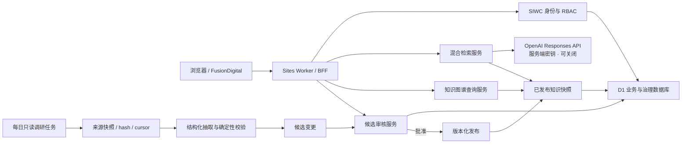
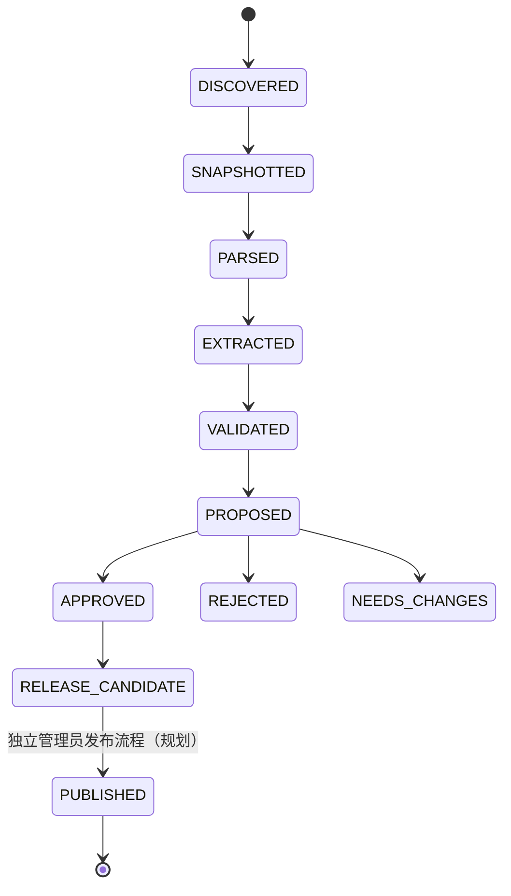

# FusionDigital AI Native 平台架构

## 1. 目标与非目标

FusionDigital 的 AI Native 改造不是在网页上增加一个聊天框，而是把身份、知识、证据、检索、图谱、调研更新和审核发布组织成一套可演进的知识基础设施。

一期目标：

1. 使用可信身份建立用户、角色、额度和审计账本。
2. 将现有物理、工程、控制、诊断、装置和智能原生调研统一成可检索、可关联、可版本化的知识实体。
3. 提供关键词检索、关系过滤和带逐条来源的模型综合回答。
4. 提供论文、代码、装置、任务、组织和模型之间的一至两跳知识图谱。
5. 每日智能体只能发现和提出候选变更；科学事实的发布必须经过确定性校验和人工审核。

一期明确不做：

- 不自建密码系统，不在浏览器保存大模型 API Key。
- 不让模型直接执行任意 SQL、任意 URL 抓取或生产数据写入。
- 不让自动任务直接删除历史事实；退役内容使用可追溯的 tombstone / superseded 状态。
- 不把生成式回答当成证据；证据只能来自带稳定标识和定位信息的来源记录。
- 不在尚未证明需求前引入第二套图数据库、消息总线或复杂分布式编排系统。

## 2. 总体架构



边界约定：

- Sites Worker 处理短请求、鉴权、配额、检索、图查询和审核操作。
- D1 保存结构化状态、关系、版本、审核和审计，不保存大型 PDF、CAD、CAE 或全文附件。
- 大型受权文件未来进入 R2；公开论文默认保存元数据、摘要和外链，不复制版权受限全文。
- 耗时较长的每日发现、PDF 解析和批量抽取放在独立任务环境；Sites 只接收已签名、已校验的候选包。

## 3. 身份、授权与租户边界

### 3.1 身份

一期使用 Sites 提供的 Sign in with ChatGPT（SIWC）。请求中的可信身份头只在服务端读取；客户端提交的 `userId`、`role` 或 `email` 永远不作为授权依据。

### 3.2 角色

| 角色 | 能力 |
|---|---|
| `member` | 使用公开检索、图谱、收藏和个人历史 |
| `contributor` | 创建调研候选和补充证据 |
| `reviewer` | 审核普通科学内容候选 |
| `admin` | 管理角色、额度、来源策略和发布批次 |
| `agent` | 仅写入候选暂存区，不得审核或发布 |

授权必须在服务端逐次校验。审核采用职责分离：候选创建者不能审核自己的高风险候选；装置闭环、许可变化、E3/E4 证据和实体合并至少需要 reviewer 审批，未来可升级为双人复核。

### 3.3 配额与审计

按用户、日期、能力和模型记录额度消耗，保留请求 ID、输入/输出 token、延迟、状态和成本估算。审计日志不保存 API Key、完整私有提示词或受限文档正文。

## 4. 证据优先的数据模型

图谱不是简单的 `node + edge`。核心模型是：

```text
Entity <- Claim -> Entity | Literal
Claim -> ClaimEvidence -> Evidence -> Source
Accepted Claim -> Materialized Relation
```

关键实体：

- `Entity`：论文、代码、装置、工具、模型、数据集、组织、人员、知识域和控制/诊断任务。
- `Evidence`：论文、官方网页、仓库、数据集或发布版本，包含 URL/DOI、抓取时间、内容哈希、许可、定位信息和访问级别。
- `Claim`：一个可审核事实；包含谓词、主客体、限定条件、证据等级、置信说明和状态。
- `Relation`：仅由已批准 Claim 投影出的查询边，方便图谱与检索读取。
- `CandidateChange`：智能体或贡献者提出的 add/update/retire/link/no-op/conflict 变更。
- `ResearchRun`：一次可重放的发现/解析/抽取运行，保存配置、模型、prompt/schema 版本和统计。

所有业务主键稳定且与标题解耦；每次运行引用确定的版本和 hash，禁止把 `latest` 写入不可变运行清单。

## 5. 检索与带引用问答

### 5.1 一期检索

一期从现有受审计 JSON 构建统一检索快照，覆盖标题、摘要、问题、装置、领域、任务、论文、代码和标签。查询流程：

1. 规范化中文、英文、缩写、DOI 和仓库名。
2. 关键词打分并结合领域、类型、装置和证据等级过滤。
3. 关系邻域补充同装置、同任务、论文—代码和验证关系。
4. 返回稳定条目 ID、原页面、证据 URL 和命中原因。

后续把同一接口接到 D1 FTS5；知识规模或语义召回需求显著增加后，再接 Vectorize / pgvector。前端不依赖具体向量供应商。

### 5.2 大模型综合

大模型只接收检索后的有限上下文，并必须：

- 只基于传入证据作答；证据不足时明确说明。
- 每个实质结论附条目 ID 和来源链接。
- 不把模型内部知识或网页搜索结果自动写入知识库。
- 使用服务端环境变量读取 API Key；浏览器永远不可见。
- 设置请求体、上下文、输出、超时、并发和每日额度硬限制。
- 默认 `store: false`；受限装置数据进入外部模型前必须经过数据分级策略。

未配置模型密钥时，接口返回确定性的检索摘要和证据清单，核心知识入口不会失效。

## 6. 知识图谱查询与可视化

图谱 API 采用受控查询参数，不接受任意 SQL/Cypher：

- 起点实体或查询词；
- 深度最大 2；
- 节点类型、关系类型、领域和装置过滤；
- 节点/边硬上限、超时和分页游标；
- 仅返回用户有权访问的实体、关系和证据。

网页默认展示聚合后的 1 跳邻域；点击节点才加载下一跳。ECharts 适合当前规模和全站设计系统，后续如需要复合节点、编辑和复杂布局，可在不修改 API 的前提下换成 Cytoscape.js。

## 7. 每日智能体流水线



流水线规则：

1. 来源必须在 allowlist 中；优先 Crossref、DataCite、arXiv、GitHub API、装置与机构官网。
2. 每个来源维护 cursor/watermark，使用重叠时间窗防漏；原始响应先快照再解析。
3. DOI、arXiv ID、GitHub repository ID、规范 URL 和内容 SHA-256 先做精确去重；模糊标题仅产生“可能相同”候选。
4. 外部 HTML、PDF 和 README 均是不可信输入；无工具 reader 与有写权限 publisher 分离。
5. LLM 必须按严格 JSON Schema 输出；确定性校验器复核 ID、URL、证据 span、年份、许可、谓词和状态。
6. Agent 只能写 candidate；不能批准、合并、发布或物理删除。
7. 发布生成不可变 snapshot 和可回滚版本指针。

> 一期上线边界：定时工作流目前只生成离线、候选制演练包并检查生产数据零改动；联网抓取、D1 候选导入和独立管理员发布流程尚未启用。页面不得把这一阶段表述为已经在夜间自动改库或自动发布。

## 8. API 设计原则

- 统一错误结构：`requestId, code, message, details?`。
- 所有写操作支持幂等键；对重复外部任务返回同一资源。
- 输入使用显式 schema、枚举和最大长度，不接受未约束 JSON。
- 列表接口使用游标/页码和 hard limit；图查询限制 fan-out。
- 写操作校验 `Origin`、身份和角色，并记录审计事件。
- 服务日志仅保存必要的运行元数据，敏感字段在进入日志前脱敏。
- 公开快照和 API 响应携带 `schemaVersion/asOf/snapshotId`。

## 9. 部署与演进

### 一期

- Sites：网页、短 API、SIWC、D1。
- D1：用户、角色、额度、审计、实体/证据/Claim/Relation、候选与审核。
- 结构化静态快照：作为 D1 导入源、无数据库/无模型时的只读回退。
- Responses API：服务端可选启用。

### 二期

- R2：许可允许的全文快照、导出和用户上传。
- Vectorize 或外部 pgvector：混合语义检索。
- 独立 research-agent Worker/Job + 队列：并发、重试、死信、源游标和告警。
- 评论、收藏、投稿和团队 workspace。

### 三期

- 经真实负载证明后再引入 Neo4j 只读投影或专业图算法。
- 私有装置知识空间、CAE 任务编排、模型服务与受控工具调用。
- 面向影子孪生的在线状态和模型适用域监控，但继续保持独立安全门。

## 10. 上线门槛

- 身份伪造、越权、配额绕过和候选自审测试通过。
- 新增 Claim 的证据覆盖率为 100%，无来源事实不进入已发布关系。
- 检索问答的引用可点击且能回到原始条目；无密钥回退路径可用。
- 图谱查询深度、规模、超时和可见性限制生效。
- 每日任务重复运行幂等；失败可重试；删除只产生 retire 候选。
- D1 migration、生成快照、构建、SSR、数据审计和发布版本全部对应同一 Git SHA。
