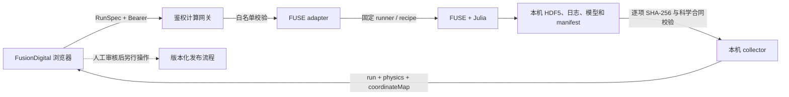

# FUSE 受控远程计算

本文记录 FusionDigital 当前的 FUSE 计算闭环。这里的“远程”是指浏览器可以连接另一台计算节点；FUSE 源码、Julia 环境、模型权重、原生 HDF5 和日志始终留在计算节点。浏览器只提交有界的运行规格，并接收通过本机校验的安全 JSON 投影。

该能力不是公开匿名计算服务，不支持上传任意程序、IMAS IDS、HDF5、装置文件或 URL。生产站的公开 `/api/simulations/catalog` 仍是只读目录，不会启动计算；但是从生产站或 Sites 页面登录到受控计算网关的浏览器，可以在其精确 origin 已列入网关白名单并提供 Bearer 令牌后提交计算。

## 架构与边界



信任关系如下：

- 浏览器是不可信参数来源。服务端重新执行严格 RunSpec 校验，不信任前端已校验的结论。
- 网关只启动仓库内固定的 `local-runner.mts` 和固定 Julia recipe；请求不能指定命令、代码、工作目录、环境变量或输出路径。
- `FUSE_WORKSPACE` 等路径只能由计算节点操作者通过进程环境设置，不能来自 HTTP 请求。
- FUSE runner 会核对固定源码 commit、干净工作树、Julia Manifest 的本地路径依赖和运行环境文件清单。
- collector 在计算节点重新计算 `run-manifest.json`、`physics.json`、`dd-native.h5`、坐标映射及 manifest 所列全部制品的 SHA-256；只有明确成功且进程已停止的任务可以收集。
- 返回浏览器的 `verification.authority` 是 `local-gateway-verified`。浏览器会再次检查 JSON 合同、运行身份和哈希字段之间的关系，但因为没有收到原生 HDF5，不能替代计算节点的原始字节校验。
- 不返回本机路径、PID、原生 HDF5、日志、源码、模型权重或环境文件内容。

当前安全结果 envelope 为：

```text
fuse-job-result.v1
├── run                 simulation-result.v1
├── physics             fuse-physics.v2
├── coordinateMap       fuse-flux-coordinate-map.v1
└── verification        local-gateway-verified + 四项 SHA-256
```

`coordinateMap` 直接取自同一次原生 equilibrium 的 `psi_norm` 与 `rho_tor_norm`，并绑定 `physics.json`、`dd-native.h5` 和投影器哈希。它用于 Te/Ti/ne 的二维、三维剖面云图，不是独立的二维输运求解。

## 前置条件

- FusionDigital 仓库和 Node 依赖已准备好。
- 计算节点已有受支持的 FUSE 工作区；默认路径为 `D:\Code\Fuse`。
- FUSE 工作区中的固定源码、Julia 1.12.7、项目环境和模型文件与 RunSpec 所声明版本一致。
- 计算节点能够承担所选线程数和超时时间。输入范围只是资源与协议边界，不代表模型适用域或装置验证范围。

## 模式一：同机 loopback

浏览器和 FUSE 位于同一台计算机时，网关保持监听 `127.0.0.1`。在单独的 PowerShell 终端中运行：

```powershell
Set-Location D:\Code\FusionDigital
$env:GATEWAY_TOKEN = Read-Host '输入至少 32 字符的随机网关令牌' -MaskInput
$env:GATEWAY_ORIGINS = 'http://localhost:5177'
$env:GATEWAY_PORT = '8791'
$env:FUSE_WORKSPACE = 'D:\Code\Fuse'
Remove-Item Env:GATEWAY_ALLOWED_HOST -ErrorAction SilentlyContinue
npm run simulation:gateway
```

`GATEWAY_ORIGINS` 中的每一项都必须等于浏览器地址栏中的实际页面 origin，包含协议和非默认端口，但不能包含路径。例如 `http://localhost:5177` 与 `http://127.0.0.1:5177` 是两个不同的 origin，不能混用。原来的 `GATEWAY_ORIGIN` 仍作为单一来源的兼容配置；不要同时设置两者，设置了 `GATEWAY_ORIGINS` 时它具有优先级。

前端“网关地址”填写 `http://127.0.0.1:8791`，令牌填写与进程中相同的秘密值。令牌只保存在当前 React 页面内存，不写入 localStorage 或 sessionStorage；刷新页面后需要重新输入。不要把令牌写进仓库、URL、截图、日志、反向代理配置样例或 shell 历史。

网关启动入口始终执行：

```text
listen(127.0.0.1, GATEWAY_PORT)
```

不得为了远程访问把它改成 `0.0.0.0` 或直接暴露裸 HTTP 端口。

## 模式二：远程 HTTPS 入口

浏览器不在计算节点上时，应在计算节点本机或可信私有隧道的入口处部署 TLS 反向代理。同一个入口可以为本机开发、香港生产站和 Sites 平台地址分别授权：

```text
香港站 https://fusiondigital.club ───────┐
香港站 https://www.fusiondigital.club ──┼→ https://compute.example（有效证书、访问控制）
Sites 的实际 *.chatgpt.site origin ─────┘   → http://127.0.0.1:8791（仅计算节点内部）
```

计算节点示例。Sites origin 必须从平台当前部署信息读取，不能猜测、使用通配符或把下面的变量换成裸 `*.chatgpt.site`：

```powershell
Set-Location D:\Code\FusionDigital
$env:GATEWAY_TOKEN = Read-Host '输入至少 32 字符的随机网关令牌' -MaskInput
$sitesOrigin = Read-Host '输入 Sites 平台实际分配的完整 https origin'
$env:GATEWAY_ORIGINS = @(
  'http://localhost:5177'
  'https://fusiondigital.club'
  'https://www.fusiondigital.club'
  $sitesOrigin
) -join ','
$env:GATEWAY_ALLOWED_HOST = 'compute.example'
$env:GATEWAY_PORT = '8791'
$env:FUSE_WORKSPACE = 'D:\Code\Fuse'
npm run simulation:gateway
```

白名单最多 16 项。每项必须是精确的 HTTPS origin，只有 `localhost` 和 `127.0.0.1` 允许 HTTP；禁止路径、查询参数、片段、账号信息、空项和重复项。网关对每个请求执行精确匹配，并在 CORS 响应中只回显本次已获准的 origin，不会返回 `*` 或后缀通配规则。

这让“从香港站提交”和“从 Sites 提交”成立，但并不意味着在两个 Web 托管端各自运行一份 Julia：

- 当前 FUSE runner 与 `D:\Code\Fuse` 基线只在 Windows 计算节点验收；现有香港发布包也不包含 Julia、FUSE 或 `scripts/simulations`。香港服务器当前只能承载 Web 前端或受控 TLS 转发。若未来要在香港服务器直接运行 FUSE，必须先完成 Linux 路径、环境脚本和 Julia 依赖适配，并通过独立真实算例验收，不能直接复用当前部署包宣称支持。
- 如果计算代码保留在另一台本机或算力节点，香港服务器只承载 HTTPS 入口或受控隧道，实际进程与原始结果仍留在该计算节点。
- Sites 只承载静态前端，不适合托管长期 Julia/FUSE 进程；它通过同一个受控 HTTPS 网关提交任务。

前端网关地址填写独立 origin，例如 `https://compute.example`。当前客户端拒绝远程 HTTP，也拒绝带路径、查询参数、片段或账号信息的地址，因此不要配置成 `https://compute.example/fuse`。

反向代理需要满足以下要求：

- 使用有效 HTTPS 证书；不要让用户关闭证书检查或浏览器安全策略。
- 上游只能是计算节点回环地址，或者经过认证的私有隧道到该回环地址；不要公开 `8791`。
- 保留 `Origin`、`Authorization`、`Content-Type` 和 `Idempotency-Key` 请求头，不在日志中记录 Authorization。
- 若代理保留外部 `Host`，将计算入口的精确值配置为 `GATEWAY_ALLOWED_HOST`，包括实际非默认端口。这里配置的是 `compute.example` 一类计算入口 Host，不是 `fusiondigital.club` 或 Sites 页面 origin。若代理明确重写为 `127.0.0.1:<port>`，应省略该变量。
- 限制来源网络、请求速率和并发，并可在外层增加企业身份认证。Bearer、CORS 和 Host 校验不能代替防火墙、TLS 和用户授权。
- 不缓存 `/v1/*` 响应。计算任务由状态轮询管理，不应依靠一个长时间保持的提交连接。

网关仍只绑定回环地址；`GATEWAY_ALLOWED_HOST` 只允许一个精确的反向代理 Host 请求头，不改变监听接口。若需要多个计算入口域名，应在反向代理层收敛到一个规范 Host，而不是放宽网关 Host 校验。

## Chrome Local Network Access

公网 HTTPS 页面访问用户电脑上的 `http://127.0.0.1:8791` 时，Chrome 或企业浏览器策略可能要求“本地网络访问”授权。前端对 loopback 请求声明 local address space，网关也响应相应的 CORS/PNA 预检，但这不等于浏览器一定会放行。

排查顺序：

1. 确认网关已启动，地址确实为 `127.0.0.1:<port>`。
2. 确认当前页面 origin 是 `GATEWAY_ORIGINS` 中的一个精确条目。
3. 在浏览器站点权限中允许该页面访问本地网络；企业策略阻止时由管理员处理。
4. 不通过关闭 Web 安全、允许不安全内容或把网关监听到公网来规避限制。
5. 若同机 loopback 受组织策略限制，使用受管的远程 HTTPS 入口。

浏览器显示“本地网络不可达”只说明连接或权限失败，不会取消已在计算节点运行的任务。恢复连接后，可在“恢复已有任务”中重新输入原任务 ID，并以当前参数表单作为预期 RunSpec 继续查询、轮询和收集；结果身份或参数不一致时会拒绝载入。当前 UI 不会把网关地址、令牌或任务 ID 持久化到浏览器存储，刷新前应自行安全记录任务 ID。

## RunSpec 参数与 JSON 导入

前端“配置与启动计算”可直接编辑参数，也可以导入 `simulation-runspec.v1` JSON。导入只更新并校验当前页面的参数表单，不会立即启动计算，也不会上传装置数据。

文件限制：

- 最大 16 KiB；必须是 JSON 对象。
- 顶层和嵌套对象必须只有合同规定的字段，所有字段均必需。
- `engineId` 必须为 `fuse`，`engineCommit` 必须等于当前固定 commit。
- 不允许 `command`、`script`、`workspace`、路径、URL、环境变量、动态 Actor 或任意输入文件字段。
- FUSE 的 `/v1/validate` 和 `/v1/jobs` 都拒绝 `snapshot` 或其他上传数据。

当前可执行范围：

| 字段 | 支持范围 |
| --- | --- |
| `recipe` | `diiid-lmode-fluxmatch`、`diiid-default-stationary` |
| `model` | L-mode 支持 `TGLFNN`、`GKNN`、`QLNN`；stationary 仅支持 `TGLFNN` |
| `solver.maxIterations` | 1–300 的整数 |
| `solver.xtol` | 0.00001–0.01 |
| `solver.stationaryIterations` | 2–10 的整数 |
| `solver.stationaryThreshold` | 0.001–0.1 |
| `resources.threads` | 1–8 的整数 |
| `resources.timeoutSeconds` | 60–7200 的整数秒 |

这些 recipe 使用计算节点上固定的离线 DIII-D 示例输入。当前明确不支持：

- 浏览器上传任意 IMAS IDS、HDF5、EQDSK、MDSplus 数据或诊断文件；
- 浏览器指定本地/网络路径，或要求网关从 URL 拉取科学数据；
- 将 EXL-50U 文件改名后套用 DIII-D recipe；
- 任意 FUSE Actor 编排、用户 Julia/Python 代码、动态插件或 shell；
- 通用 Docker/HPC 调度、持久队列、断点续算或跨重启幂等。

`GET /v1/inputs/fuse-profile` 是已有 FUSE 安全投影到 TORAX 的只读剖面快照接口，不是 FUSE 任意输入上传接口。

## 前端操作流程

1. 打开“仿真模拟 → FUSE → 配置与启动计算”。
2. 选择固定流程和输运模型，设置求解参数、线程和超时；或导入合法 RunSpec。
3. 填写 loopback 或 HTTPS 网关 origin，并输入令牌。
4. 点击“测试鉴权连接”。目录必须声明 `executionEngineIds` 包含 `fuse`。
5. 点击“启动 FUSE 计算”。同一 RunSpec 的网络重试使用同一个 Idempotency-Key，不会重复创建任务。
6. 页面约每 2.5 秒读取状态，也可手动刷新或请求取消。取消是协作式请求，应等待明确终态。
7. 任务成功后，页面自动收集并校验安全结果，然后可以切换到新结果的指标、剖面、二维和三维视图。
8. 按需下载运行记录、物理投影或坐标映射。它们仍是安全投影，不包含原生计算归档。
9. 页面刷新或网络中断后，重新填写网关地址与令牌，在“恢复已有任务”中输入完整 `fuse-diiid-*` 任务 ID；当前参数必须与该任务的 RunSpec 一致，成功任务才会重新收集安全结果。

新结果只加入当前浏览器会话，不写入版本化 catalog、数据库或公开静态资源。刷新页面即丢失前端会话结果；计算节点上的不可变 attempt 目录不会因此删除。

## 状态、并发与恢复

统一网关并发上限为 1，FUSE 与 TORAX 共享该上限。FUSE 工作区另有磁盘 lease，阻止独立进程同时写入同一结果空间。

| 状态 | 含义 |
| --- | --- |
| `queued` | 网关已受理，runner 尚未形成可读状态 |
| `starting` | 正在核对环境与启动 Julia |
| `running` | 受监督的 FUSE 计算正在运行 |
| `cancellation-requested` | 已写入取消信号，尚未确认终止 |
| `succeeded` | 执行与本机收集前置检查成功 |
| `failed` | 启动或计算失败 |
| `timed-out` | 达到 RunSpec 超时并完成停止流程 |
| `cancelled` | 取消完成并已确认终止 |
| `collection-failed` | 结果缺失、科学检查或制品核验失败 |
| `reconciliation-required` | launcher 状态不足以证明 Julia/后代已停止，需要人工核对 |

状态可以包含 `startedUtc`、`finishedUtc`、`elapsedSeconds` 和最后一个受控阶段 `latestStage`。阶段是离散事件，不是计算完成百分比，前端不会伪造进度条。

只有状态属于明确终态且 `processStopped === true` 时，网关才释放全局活动任务。Node launcher 退出本身不证明 Julia 或其后代停止；此时保持 `reconciliation-required`、`processStopped: false` 并阻止新任务。操作者应检查 attempt 状态、受控日志和实际进程树，在确认没有存活计算进程及写入活动后再按运维流程处理 lease；不要依据磁盘中的旧 PID 直接杀进程，也不要为恢复服务盲删锁文件。

幂等键只在当前网关进程内保存，最多 1000 个。相同键和相同请求体返回原任务 ID；相同键对应不同请求体会冲突。网关重启后不承诺恢复幂等映射，也不是持久化调度系统。

## API 摘要

除 CORS 预检外，以下接口都要求 `Authorization: Bearer <token>`：

| API | 方法 | 行为 |
| --- | --- | --- |
| `/v1/catalog` | GET | 返回本地可执行引擎、配方和并发上限 |
| `/v1/validate` | POST | 校验 `{spec}`，不启动计算 |
| `/v1/jobs` | POST | 幂等提交 `{spec}` |
| `/v1/jobs/:id` | GET | 获取状态和最近阶段，不暴露 PID/路径 |
| `/v1/jobs/:id/cancel` | POST | 请求协作式取消 |
| `/v1/jobs/:id/result` | GET | 仅对已成功且已停止的任务返回安全结果 |

请求体上限为 128,000 字节；前端对 RunSpec 使用更严格的 16 KiB 上限。响应统一 `Cache-Control: no-store`，前端还对网关 JSON 响应施加 24 MiB 上限。

## 临时查看与审核发布必须分离

网关计算成功只说明：固定 recipe 已执行、本机数据检查通过、制品身份和哈希一致。它不自动表示：

- 严格数值收敛已经建立；
- DIII-D 或其他装置结果已通过实验验证；
- 模型适用于 EXL-50U；
- 当前结果已获准进入公开仓库或生产网站。

浏览器会话中的结果用于即时分析和可视化。若要进入版本化目录，维护者必须在计算节点保留的精确 attempt 上执行独立审核与显式发布流程，检查输入来源、模型资格、数值证据、许可、公开字段和坐标映射，再形成代码提交并走项目正式发布门禁。网关不会自动写入 `public/data`、结果 catalog、Git、Codeup、GitHub、香港 ECS 或 Sites。

因此，推荐的数据身份始终保持分离：

- `facility-record`：装置或实验记录；
- `simulation-run`：本次 FUSE 计算；
- `comparison-record`：两者经过明确映射后的比较。

不能把网页上传文件、会话投影或模拟结果静默升级为实验事实。
