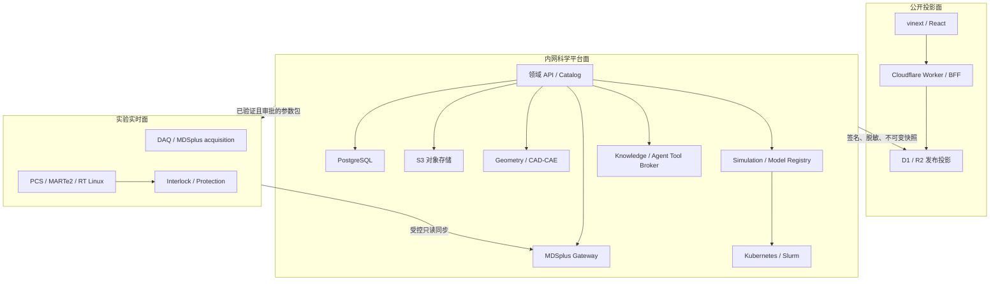

# FusionDigital 整体技术路线图

**版本：** 2026-08-15  
**范围：** 知识平台、三维可视化、LLM/智能体、物理与工程仿真、诊断感知、集成控制及数据基座。

## 1. 执行摘要

FusionDigital 当前已经不是纯静态网站。代码中已具备 React/vinext 前端、Cloudflare Worker、Sign in with ChatGPT、D1 用户/角色/配额/审计、研究候选审核、确定性检索、知识图谱、OpenAI Responses API、DeviceManifest 三维资产和 10 炮 5,804 帧 EFIT 回放。

但当前系统仍应定义为：

> 公开研究门户 + 静态知识快照 + 浏览器三维/EFIT 可视化 + D1 身份与审核控制面。

它尚未运行连接 MDSplus、NAS、对象存储、PLM/PDM、CAD/CAE、MEQ/FGE、DINA、诊断流或 PCS。继续把这些能力直接塞进现有 Web 项目，会把公开内容、科学数据、长任务和实时控制混成一个不可维护的系统。

目标架构采用三平面：

1. **公开投影面**：保留现有 Sites/vinext/Worker/D1，提供公开知识、公开三维、公开 EFIT 和带引用问答。
2. **内网科学平台面**：承载目录、对象存储、MDSplus 网关、PLM/PDM 引用、仿真作业、诊断产品、知识与智能体工具。
3. **实验实时面**：承载 DAQ、PCS、联锁、保护和确定性实时算法；不允许浏览器、普通 Kubernetes 服务或 LLM 直接下发命令。

三者只通过已审查、签名、版本化的数据产品和任务合同连接。

## 2. 当前系统真实基线

| 能力 | 已实现 | 当前缺口 |
|---|---|---|
| Web/BFF | React 19、vinext、Cloudflare Worker | 无独立领域 API 或服务网关 |
| 身份与控制面 | SIWC、D1、角色、配额、审计、候选审核 | 无企业 OIDC/项目级 ABAC |
| 知识检索 | Git 中生成的统一 JSON、确定性检索、无密钥回退 | D1 知识表尚未成为读取源；无语义检索 |
| 知识图谱 | 静态图谱快照与受控 1–2 跳查询 | 未与 D1 Entity–Claim–Evidence 模型统一 |
| LLM | 服务端 Responses API、引用约束、配额 | 无 AI Gateway、Tool Broker 和模型注册 |
| 研究智能体 | 离线 dry-run、候选状态机、职责分离 | 未联网发现、自动导入或发布 |
| 三维 | DeviceManifest、GLB/Meshopt、LOD、装配树、剖切 | 无 PLM/PDM 连接器、ResultManifest、通用 CAE 场 |
| EFIT | v1/v2 混合数据源、哈希、分块加载、3D 叠加 | 无 MDSplus/Object Storage 运行时数据源 |
| 仿真 | 知识条目与页面规划 | 无 SimulationRun、容器调度、结果仓库 |
| 诊断与控制 | 研究目录与证据图谱 | 无诊断状态产品、SIL/HIL、PCS 接口 |

现有技术债主要有四项：

- 静态搜索快照、静态图谱快照和 D1 知识表形成三套潜在真值。
- EFIT 分块白名单写在 Worker 代码中，新增炮数据需要重发网站。
- 大型报告、GLB、EFIT 分块和研究资产进入 Git/站点发布包，放大发布与回滚成本。
- `docs/ARCHITECTURE.md` 等文档曾落后于真实 D1/三维/EFIT 实现，需要把代码合同作为事实源。

## 3. 目标架构与安全域



边界规则：

- 浏览器不直接访问 MDSplus、NAS、PLM/PDM、求解器或 PCS。
- NAS 是落盘与归档介质，不作为 Web API 或主目录。
- 大文件放对象存储；数据库只保存元数据、ACL、版本、血缘、状态和对象引用。
- Sites Worker 处理短请求；解析、抽取、仿真和 CAE 均异步作业化。
- AI/智能体只使用白名单工具并生成候选，不直接执行任意 SQL、Shell、URL、MDSplus 写入或 PCS 命令。
- 实时控制链和科研 IT 链保持网络与责任隔离。

## 4. 领域服务与统一对象

第一阶段采用“模块化单体 API + 独立计算任务”，不为了微服务而拆分。建议领域边界如下：

| 服务 | 主要职责 |
|---|---|
| Catalog Service | 装置、炮号、信号、数据集、CAD、模型、文档和权限元数据 |
| Artifact Service | 大文件、哈希、版本、保留策略、对象引用和签名 URL |
| Shot Service | MDSplus tree/shot/node 发现、信号读取、时间基和质量位 |
| Geometry Service | CAD 主数据引用、装配树、坐标变换、LOD 和网页派生 |
| Simulation Service | 模型注册、RunSpec 校验、提交、状态、取消和结果收集 |
| State Service | 诊断产品、状态估计、不确定度、历史回放和影子状态 |
| Knowledge Service | Entity、Claim、Evidence、Relation、检索和图谱 |
| Agent Tool Broker | 受控检索、数据读取、仿真提交、结果解释与候选变更 |
| Release Service | 内网资产到公开快照的审查、签名、发布和回滚 |

必须先冻结的核心对象：

- `DeviceRevision`
- `Shot`
- `SignalDescriptor`
- `DataProduct`
- `CoordinateFrame`
- `ArtifactManifest`
- `EquilibriumFrame`
- `SimulationModel`
- `SimulationRun`
- `ResultManifest`
- `DiagnosticProduct`
- `ControlScenario`
- `Entity / Claim / Evidence`
- `AgentRun`
- `Release`

每个对象至少包含 `id`、`schemaVersion`、`revision`、`contentHash`、`classification/acl`、`coordinateFrame`、`units`、`timebase`、`provenance`、`quality`、`createdAt` 和 `supersedes`。

每个新模块必须同时交付：Schema、Adapter、Contract tests 和 Search/graph projection。

## 5. 数据基座

### 5.1 权威角色

| 系统 | 定位 | 不应承担 |
|---|---|---|
| MDSplus | 实验模型、pulse file、原始及处理信号的权威来源 | 公开网页直连、跨域元数据总目录 |
| NAS | 原始落地、历史归档、备份来源 | 在线查询 API、权限与版本目录 |
| S3 对象存储 | 大型、不可变、带版本的资产、模型和结果 | 关系查询、任务状态机 |
| PostgreSQL | 目录、权限、血缘、任务、知识、审核 | 大型时序数组、CAD/CAE 文件 |
| D1 | 公开站身份、配额、审计和发布投影 | 科学数据仓库、长任务调度 |
| PLM/PDM | CAD、材料、配置基线和工程审批 | 浏览器渲染派生和公开分发 |

### 5.2 数据分层与格式

- **Raw**：MDSplus、gfile、诊断图像、CAD/CAE、PDF；只增不改。
- **Canonical**：统一装置/炮号/信号 ID、单位、坐标、时间基、质量和 IMAS/EXL 映射。
- **Curated**：经校验的训练集、EFIT 序列、诊断状态和仿真输入包。
- **Serving**：Parquet、Zarr、Arrow、glTF、VTK、检索索引和公开快照。

推荐格式：

- MDSplus 保持实验原始炮数据。
- Zarr/HDF5 保存 N 维科学数组。
- Parquet 保存表格、事件和分析结果。
- Arrow/Arrow Flight 用于进程间和服务间列式交换。
- JSON 只承载小型元数据和 Manifest。
- 采用 IMAS/OMAS 作为跨代码语义映射骨架，但不强迫第一天重写所有 MDSplus 原始树。

## 6. 三维、CAD 与 CAE

- STEP/BREP/Parasolid 继续由 PLM/PDM 管理，是工程权威源。
- glTF/GLB + Meshopt/KTX2 是浏览器运行时派生格式。
- Three.js 保留用于装配、拾取、透明度、剖切、动画和 EFIT 叠加。
- vtk.js 用于标量场、矢量场、等值面、切片和体渲染。
- CAE 原生文件继续留存；显示层派生为 VTK/VTI/VTP/VTU、XDMF+HDF5、CGNS 或 Exodus。
- 超大结果使用 ParaView/trame 等服务端渲染，不把全量网格传给浏览器。

几何合同必须锁定单位、手性、原点、轴方向、R-Z-φ/XYZ 映射、CAD→EFIT 变换、稳定部件 ID、LOD、源哈希、派生哈希和访问级别。

## 7. 仿真与任务编排

所有 EFIT、MEQ/FGE、DINA、物理及 CAE 求解器实现统一适配器：

```text
describe()
validate(inputPackage)
submit(runSpec)
status(runId)
cancel(runId)
collect(runId)
health()
```

每次运行生成不可变 `RunManifest`，包含：输入 URI/哈希、Git SHA、OCI image digest、参数、单位、坐标、网格、时间步、随机种子、资源、许可证、超时、输出 schema、VVUQ 状态和所有输出哈希。

技术选择：

- 本地：Docker Compose。
- 私有生产：Kubernetes Jobs + Argo Workflows。
- 既有 HPC：保留 Slurm，由 Compute Broker 适配。
- 镜像：企业 OCI Registry/Harbor，固定 digest、签名和 SBOM。
- 事件：NATS JetStream + CloudEvents；消息只传 `ArtifactRef`、状态和哈希。
- 多日人工补偿工作流复杂到 Argo 无法合理表达时，再评估 Temporal；一期不同时引入两套工作流。

## 8. 诊断感知与集成控制

`StateEstimate` 必须包含时间戳/时间基、估计值、不确定度、诊断及标定版本、缺失通道、质量位、模型版本、适用域和处理延迟。

控制接入按以下阶梯推进：

1. 历史回放。
2. SIL 软件在环。
3. 控制器—被控对象联合仿真。
4. HIL 硬件在环。
5. 影子模式。
6. 通过正式装置安全流程后，才讨论有限低风险闭环。

MEQ/FGE、DINA 可先以原生容器适配，成熟的 reduced plant/controller 可考虑 FMI 3.0 与 SSP。硬实时节点继续使用现有 PCS、MARTe2、PREEMPT_RT 或专用实时平台，不迁移到 Kubernetes。

## 9. LLM 与智能体

能力分级：

- L0：带引用知识检索。
- L1：只读数据分析。
- L2：生成仿真输入候选。
- L3：提交离线仿真任务。
- L4：生成控制参数候选，但必须人工审批。
- 禁止：直接改库、执行任意 Shell/URL、写 MDSplus 或控制 PCS。

建议保留当前服务端 Responses API，同时增加供应商无关 AI Gateway 和严格 Tool Broker。工具仅暴露受控能力，例如 `search_evidence`、`get_shot_metadata`、`read_signal_slice`、`get_geometry_manifest`、`submit_simulation`、`get_run_result` 和 `propose_candidate_change`。

模型与代理模型使用 MLflow/OCI 管理版本、别名、训练运行、模型卡、适用域和批准状态；可部署格式优先 ONNX/FMU。每次调用记录用户、模型、prompt/schema 版本、输入输出哈希和权限结果。

## 10. 技术栈决策

| 层 | 推荐选型 | 采用时机 |
|---|---|---|
| 公开体验 | React 19、vinext、Worker、D1/R2 | 保留并收敛职责 |
| API | FastAPI、Pydantic、OpenAPI 3.1 | P1 |
| 内部 RPC | gRPC/Protobuf、Arrow Flight | 有高吞吐/跨语言需求时 |
| 元数据 | PostgreSQL + JSONB + FTS + pgvector | P1 |
| 大资产 | MinIO 或 Ceph RGW；公开投影 R2 | P1 |
| 科学格式 | MDSplus、Zarr/HDF5、Parquet、Arrow | P1 |
| 三维/场 | Three.js、glTF/Meshopt、vtk.js、XDMF/HDF5 | P2 |
| 计算 | Docker、Kubernetes Jobs、Argo、Slurm Adapter | P2 |
| 事件 | NATS JetStream、CloudEvents | P3 |
| 模型 | MLflow、OCI、ONNX/FMU | P2–P5 |
| 可观测 | OpenTelemetry、Prometheus/Grafana、Loki/Tempo | P1 起 |
| 身份密钥 | 企业 OIDC/Keycloak/Entra ID、Vault/KMS | P1 |

暂缓：全面微服务化、Iceberg/Trino 湖仓、Neo4j、OpenSearch、Kafka、Service Mesh，以及任何 LLM 自动发布或公网直连实验/控制域。

## 11. 分阶段路线

工期按 8–10 人核心团队估算；3–4 人团队通常需要约两倍日历时间。

| 阶段 | 工期 | 主要交付 | 核心验收 |
|---|---:|---|---|
| P0 清债与合同冻结 | 4–6 周 | ID/单位/坐标/时间、RunManifest v1、资产盘点 | 18303 + 1 CAD + 1 仿真黄金链路可重放 |
| P1 数据基座 | 8–12 周 | PostgreSQL、对象存储、OIDC、MDSplus/NAS/CAD/文档适配器 | 原始不可变、血缘 100%、权限和恢复演练通过 |
| P2 仿真与三维 | 10–14 周 | MEQ/DINA/EFIT Run API、K8s/Slurm、ResultManifest、vtk.js | 失败重试、取消、重放和资源配额通过 |
| P3 诊断与影子状态 | 10–14 周 | shot 事件、同步、质量位、状态估计、历史回放 | 乱序、缺失、延迟、漂移注入通过 |
| P4 SIL/HIL/影子控制 | 12–18 周 | 联合仿真、签名参数包、HIL/影子、双人审批 | 时延、故障回退、隔离、安全评审通过 |
| P5 智能体平台化 | 8–12 周，可并行 | AI Gateway、Tool Broker、RAG、候选任务 | 引用、拒答、越权和注入测试通过 |

数据+仿真+三维 MVP 约 5–7 个月；诊断影子平台约 8–12 个月；可审查 SIL/HIL/影子控制约 12–18 个月。安全关键闭环不能按普通软件项目承诺。

## 12. 未来 90 天

只集中完成六件事：

1. 冻结 `Device/Shot/Signal/Geometry/Run/Artifact` 合同。
2. 明确 MDSplus、NAS、对象存储、PostgreSQL、D1 和 PLM/PDM 的权威边界。
3. 建立 18303 黄金炮端到端数据包。
4. 将 MEQ/FGE、DINA、EFIT 包装为同一 Run API。
5. 建立 CAD–EFIT 坐标注册和浏览器派生管线。
6. 建立 VVUQ、信息分级、审批和发布快照门禁。

## 13. 主要风险与验收

| 风险 | 控制措施 |
|---|---|
| CAD/装置数据泄露 | 资产目录、对象级 ACL、派生流水线、双人发布审批 |
| 坐标/单位/时间不一致 | 公共合同、黄金数据、跨适配器 contract tests |
| 三套知识真值并存 | PostgreSQL 成为写入源，静态 JSON/D1 只做发布投影 |
| 求解器不可复现 | OCI digest、RunManifest、输入输出哈希、SBOM |
| 仿真结果冒充权威 | authority、VVUQ、适用域和禁止用途进入机器可读元数据 |
| 智能体越权 | 工具白名单、最小权限、候选制、人工审批、审计 |
| Web 路径进入实时控制 | 网络隔离、单向同步、签名参数包和独立保护域 |

验收底线：输入输出血缘 100%；固定运行可由镜像 digest、数据快照与参数清单重放；时间、坐标、单位合同全通过；缺失/乱序/延迟/漂移有明确质量状态；未审批模型不能进入生产候选；控制与安全相关升级需独立 SIL/HIL/影子证据。

## 14. 参考规范与官方资料

- [MDSplus Documentation](https://www.mdsplus.org/index.php/Documentation)
- [Zarr v3 Core Specification](https://zarr-specs.readthedocs.io/en/latest/v3/core/)
- [Apache Arrow Columnar Format](https://arrow.apache.org/docs/format/Columnar.html)
- [Arrow Flight RPC](https://arrow.apache.org/docs/format/Flight.html)
- [gRPC Introduction](https://grpc.io/docs/what-is-grpc/introduction/)
- [Kubernetes Jobs](https://kubernetes.io/docs/concepts/workloads/controllers/job/)
- [NATS JetStream](https://docs.nats.io/nats-concepts/jetstream)
- [OpenTelemetry](https://opentelemetry.io/docs/)
- [Temporal Documentation](https://docs.temporal.io/)
- [FMI 3.0](https://fmi-standard.org/docs/3.0.1/)

最重要的技术决策不是再增加一种框架，而是先稳定统一合同、权威源边界和可重放证据链。只有这三件事稳定，后续物理、工程、诊断、控制和智能体模块才不会继续放大当前的臃肿。
