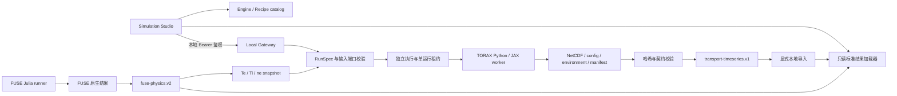

# 多引擎仿真工作台实施记录

二维展示追加更新：[TORAX 二维云图：结果、输入与映射](TORAX_2D_FIELDS.md)。包含全部算例的原生时间—半径云图、STEP 原生输入磁平衡及标注明确的 R–Z 剖面映射；不改变本文的数值/实验资格边界。

远程计算更新：[TORAX 远程计算与本机节点](TORAX_REMOTE_COMPUTE.md)、[FUSE 远程计算](FUSE_REMOTE_COMPUTE.md)。当前网关已同时适配 FUSE/TORAX；TORAX 支持 HTTPS 节点、参数/剖面上传、任务恢复和同次计算二维结果返回。下文有关仅 TORAX 执行白名单、仅本地前端及未提供远程参数交互的描述属于首次集成阶段记录，当前行为以两份远程计算文档为准。

2026-09-07；起点 `2a62d44752b951e6ee1d6a3456528fe5a1857de3`。Codeup master 与 GitHub main 已 fetch，执行 `pull --ff-only` 后为 already up to date，本地包含远端 `3500ac1…` 之上的 FUSE 平衡展示提交。已有用户文档和 AGENTS 修改不属于本任务。

## 目标与分层

- 同一 `/simulations` 入口保留 FUSE 物理、工程及三维结果，加入 TORAX 可交互时序和案例库。
- 用 EngineDescriptor / Recipe / RunSpec / Attempt / Artifact / TransportResult 分开能力、实现、执行与科学数据；纯数据合同与 React、Node、Python 运行时独立。
- 通用输运 profile 使用单位明确的时间、径向轴、二维数组；FUSE 旧 profile 保持兼容。二维平衡不是纯输运结果的必需字段。
- 多案例真实运行，保留 NetCDF、配置、环境、科学资产、来源和结果哈希；通过审核 importer 只把安全投影放进公开前端。
- 工作流以不可变结果端口传递数据。本轮 FUSE→TORAX 验证 Te/Ti/ne 的初始化传递；任何几何近似、热源替代和时标重置都显式登记，不宣称已完成自洽双向耦合。
- 后端提供独立本地执行器和可选鉴权网关，公开匿名站点不执行 Python/Julia、不开放匿名计算写入。

## 实施顺序与验收

1. 引擎中立合同、目录、可比较性和输入映射规则；严格参数、单位、轴、来源与大小检查。
2. Python worker + 本地执行器 + 受控导入；运行官方/派生/跨引擎案例并回读验证。
3. 统一引擎切换、案例选择、时间滑块/播放、初末态对照、时序、数表、证据、配置与数据导出。
4. 独立 API 接入合同、执行状态与工作流视图，保留未来 Docker/HPC、其他求解器的适配边界。
5. 合同/映射/状态/取消/完整性测试，真实 TORAX 执行验收，FUSE 回归、构建和项目检查。

## 必须保留的科学与发布边界

`simulated`、执行成功、数值检查、网格收敛与装置验证分别记录。TORAX 的 COCOS 未统一，不能冒充 FUSE 的 COCOS 11；同名径向坐标也不意味着同一磁平衡。不同装置或不同源项的结果只能并列查看，不能自动算精度排名。生产 DNS、香港/Sites 发布均不属于本次功能实现授权。

## 已交付功能

本地预览：`http://localhost:3012/simulations?engine=torax`。原 FUSE 工作台仍在 `?engine=fuse`，协同说明在 `?engine=workflow`。本次没有提交、推送或发布生产版本。

前端增加统一引擎切换，保留已访问引擎的组件状态；原 FUSE 的物理、工程、二维云图、三维磁面和原生运行导入不变。TORAX 提供官方/派生/联动案例分组、模拟时间回放、初始/当前剖面对照、FUSE 输入参考、全局量时序、同族算例对比、原单位数表、CSV/完整 JSON 导出、带两个源记录的 comparison-record 导出、配置表单和可选本地网关连接。结果通过内容哈希加载，加载失败不会回填模拟数字。

运行配置修改不会改写当前结果；连接本地网关后可以提交独立运行，读取状态、请求取消、下载并探索新结果。只读案例目录通过本地显式 `publish` 命令更新；这里的 publish 仅导入仓库内的安全数据投影，不部署网站。

后端已实际实现 TORAX 的版本绑定、可信配方映射、有界参数校验、单运行租约、不可变 attempt、WSL 内部进程组监督、状态事件、超时/取消、原生 NetCDF 保存、配置/环境/科学文件哈希、成功结果收集和内容寻址压缩导入。FUSE 使用现有成熟 Julia runner；新网关的执行白名单目前只有 TORAX，未假称所有 FUSE actors 已可经新网关调度。

## 分层架构与可替换边界



| 层 | 当前代码 | 职责与扩展方式 |
| --- | --- | --- |
| 引擎/案例注册 | `app/simulations/platform/catalog.ts` | 能力、版本、配方、输入输出类型；不混入 Python 命令 |
| 标准合同 | `platform/contracts.ts` | 参数、单位、时间/径向轴、数组形状、身份、血缘及大小上限；不依赖 React 或引擎私有对象 |
| 比较记录 | `platform/comparison.ts` | 同装置/同物理族、同模拟时间、明确差值方向；保留双方配置和原生结果哈希，不输出精度排名 |
| 结果展示 | `platform/TransportWorkspace.tsx`、`display.ts` | 按通用时序/剖面合同渲染；保留 cell/face/boundary 网格，不强塞二维平衡 |
| FUSE 展示 | `FuseWorkspace.tsx` 及原 physics/engineering 模块 | 原投影和二维/三维能力不因 TORAX 接入而降级 |
| 本地控制面 | `scripts/simulations/gateway.mts` | 鉴权、精确 Origin/Host、请求上限、幂等提交、状态/取消/收集 |
| 执行及数据面 | `engine-service.mts`、`engine-cli.mts` | Node/WSL 路径边界、租约、快照哈希、attempt、导入；不进入 Web bundle |
| TORAX adapter | `scripts/simulations/torax/adapter.py` | 可信官方 config → 明确覆盖 → 运行 → 标准投影；固定源码 commit |
| 进程监督 | `torax/supervisor.py` | Linux 拥有进程组；TERM/KILL、wait、检查组内活进程后再声明停止 |
| 公开接口 | `/api/simulations/catalog` | 描述符/配方/已发布结果目录，只读，不提供匿名运行 API |

当前合同做到了“结果格式独立于引擎”，执行适配器仍是显式白名单。接入新引擎时应新增其 validator/launcher/collector，并注册输入输出合同；如果输出满足 `transport-timeseries.v1`，可复用当前剖面/时序显示。如果输出是二维平衡、工程网格或诊断图像，应新增独立结果 profile/renderer，不能给输运合同补伪造字段来凑形状。

`EngineDescriptor.capabilities` 是适配范围，不是每次运行的能力或资格证明。FUSE 71 actors/18 families 的原目录继续保留；是否有结果应读取具体记录的 coverage。TORAX 模型选择本轮以可信配方提供；任意 Python config、路径、命令或动态插件都不能由浏览器提交。

## 环境与装置信息

- 官方源码：<https://github.com/google-deepmind/torax>，`D:\Code\Torax`，v1.4.3，commit `4aea2377385ba4dfe37b0ef4396374162af1314b`。
- 执行：WSL Ubuntu；`D:\Code\Torax\.venv-wsl`，Python 3.12.14，JAX/jaxlib 0.10.0，fusion-surrogates 0.4.6，CPU float64；无 GPU 性能或资格声明。
- 恢复环境与原始 demo 说明：`D:\Code\Torax\local\reports\TORAX_SETUP_DEMO_AND_FUSIONDIGITAL_INTEGRATION.md`。本次不更改系统 Python 或全局 Git 配置。
- 新运行原生目录：`D:\Code\Torax\local\platform-runs\<id>`；公开 gzip 共 1,501,752 字节，约 1.43 MiB（8 个案例），原生 NetCDF/环境不放入公开 bundle。

**TORAX 并不绑定某一个装置。** 装置信息由每个 config 的几何、初始/边界条件、等离子体组成和源项决定。本轮 basic 使用 ITER 尺度的圆截面测试几何；ITER hybrid/ramp-up 使用仓库 CHEASE `iterhybrid.mat2cols` 及场景参数；STEP 使用 OpenSTEP SPP-001 ECHD 的 IMAS 文件，属于设计场景数据；FUSE 联动使用 DIII-D 来源的模拟剖面及显式近似接收模型。它们都不是实时装置观测。不能把 ITER/STEP 的计算结果标到 EXL-50U 装置记录下。

许可：TORAX Apache-2.0；CHEASE 数据附 PINT MIT 许可；STEP 数据按仓库 `torax/data/licenses/LICENSE_OpenSTEP`；fusion-surrogates 代码 Apache-2.0，模型/其他材料的许可按其发行内容（包括 CC-BY-4.0）保留署名与来源。新模型/装置数据接入需携带自己的许可，不继承代码许可证。科学资产的文件名及 SHA 已进入各运行投影；原始来源许可证位于 TORAX 工作区。

## 已执行算例与结果

下表为已归档计算的终态值，标准 JSON 保留 W、eV、A、J 等原合同单位；这里将功率换算为 MW。全部结果 `sim_error=0`、完整到达配置终止时间、核心温度/密度为有限正值。Q 是 TORAX 输出的 `Q_fusion`，不是发电效率或实验测量。

| 案例 | 时间 s | 径向单元 | 步数 | 终态聚变功率 MW | Q |
| --- | ---: | ---: | ---: | ---: | ---: |
| 基础热输运 | 5 | 25 | 21 | 390.118470 | 3.159962 |
| ITER hybrid | 5 | 25 | 31 | 352.547921 | 6.912704 |
| ITER ramp-up | 80 | 25 | 40 | 3.181306 | 0.139045 |
| STEP 非感应平顶 | 400 | 100 | 40 | 1305.609750 | 8.700141 |
| ITER 通用辅助加热 −20% | 5 | 25 | 25 | 340.667386 | 8.349691 |
| ITER 通用辅助加热 +20% | 5 | 25 | 36 | 360.132775 | 5.884522 |
| ITER 50 单元网格 | 5 | 50 | 125 | 382.530811 | 7.500604 |
| FUSE→TORAX Te/Ti/ne | 0.2 | 50 | 38 | 0（未启用聚变源） | 0 |

官方四配方来自 `torax/examples/basic_config.py`、`iterhybrid_predictor_corrector.py`、`iterhybrid_rampup.py`、`step_flattop_bgb.py`。派生加热研究只改变 hybrid 的 `generic_heat.P_total`：51 MW → 40.8/61.2 MW；不是把所有源项乘同一因子。50 单元案例只修改径向网格，但 chi 步长策略随网格改变，时间步也由 31 增至 125，因此不能将功率变化全部归因于纯空间误差。

ITER hybrid 人为电阻率倍率 200，STEP 为 10，ramp-up 为 1。STEP 400 秒输出并不证明物理尺度上所有电流已充分松弛。加热减小后 Q 增大主要涉及分母和耦合响应；不能据此直接给出优化建议。25→50 单元终态聚变功率改变约 8.50%，提示需要继续进行空间/时间分离的收敛研究，不能宣称当前结果已网格无关。

### FUSE→TORAX 的实际映射

源记录 `fuse-diiid-20260906174722551-3ffd17fc`，record SHA `bf3b9551e1fbcebe9b4be9ad4f69cfc240eea2670533fbefd352ea8993416312`；FUSE 安全物理投影 raw SHA `079486db86ee3c90440ced11a6f35124ca8db5331bb5fdb69ccd0adde3e425bf`。快照 producer 会先验证 gzip/raw 哈希及 run ID，再提取 Te、Ti、ne，保留源 coreTimeSeconds。接收端模拟时间重新从 0 s 开始，不冒充源放电时间的连续积分。

| 项目 | 实际行为 |
| --- | --- |
| 传递的量 | 101 点 Te/Ti/ne，ρtor,norm 覆盖 [0,1]；只接受有限正值 |
| 温度单位 | FUSE eV → TORAX 输入 keV；输出再转为标准 eV；图表显示 keV |
| 密度单位 | m⁻³，不作 Greenwald 分数归一化；JSON 中的大整数显式转 float64 |
| 插值 | ρtor,norm 上线性插值到 TORAX 50 个有限体积单元；轴/边界重建值单独对待 |
| 初始单元校验 | Te 最大相对差 `1.1102230246251565e-16`；Ti、ne 为 0；容差 1e-10 |
| 接收几何 | 显式 DIII-D-like circular：R=1.6955 m，a=0.60 m，B=+1.70904 T，Ip=+1.08374265 MA |
| 模型 | 常数热输运，D 主离子/C 杂质，Zeff=1.6，无 pedestal，冻结密度和电流演化 |
| 加热 | 2 MW 通用辅助加热 + 单独计算的欧姆加热 + 离子电子能量交换；外部总功率不等于 2 MW |
| 聚变源 | 关闭；功率 0 表示该源未配置，不是 D-D 反应率为零的物理预测 |
| 没有传递 | FUSE 二维平衡、负 q、电流剖面/符号变换、真实源项、自洽几何反馈 |

TORAX 尚无统一 COCOS，FUSE 的 COCOS 11 不能直接赋给 TORAX。即使两侧坐标都叫 ρtor,norm，接收圆截面也不代表同一磁面或同一体积元素。这次联动证明“数据端口→转换→初始化→可追溯演化”的链路，不证明跨引擎数值一致性或 DIII-D 放电复现。

## 使用方法

在 `D:\Code\FusionDigital` 中运行。Node/npm 沿用现有项目环境。PowerShell 中无需激活 TORAX Linux venv，runner 会通过 WSL 使用它。

```powershell
# 本地前端
npm run dev -- --host 127.0.0.1 --port 3012

# 列出引擎与配方；导出并运行独立配置
npm run simulation:engine -- catalog
npm run simulation:engine -- template iter-hybrid tmp/iter-hybrid.json
npm run simulation:engine -- validate tmp/iter-hybrid.json
npm run simulation:engine -- run tmp/iter-hybrid.json

# 控制面不会猜测停止状态；取消后读取 terminal state 和 processStopped
npm run simulation:engine -- status <run-id>
npm run simulation:engine -- cancel <run-id>
npm run simulation:engine -- collect <run-id>

# 仅将已验证安全投影导入本地案例目录；不会部署网站
npm run simulation:engine -- publish <run-id>

# 从已验证 FUSE 投影重新生成快照与绑定配置
npm run simulation:engine -- snapshot tmp/fuse-profile.json
npm run simulation:engine -- template fuse-profile-handoff tmp/handoff.json
npm run simulation:engine -- run tmp/handoff.json

# 重新运行全部八案例并逐一导入，会产生新的不可变 attempts
npm run simulation:engine -- demo-suite
```

CLI 联动 run 会从当前已验证 FUSE 目录重新生成快照并匹配 RunSpec SHA；源发生变化时拒绝旧绑定，需重新生成并审查配置。STEP 只接受 heatingScale=1；其他配方的通用加热倍率范围 [0.5,1.5]，径向单元 [10,100]，时长 [0.01,400] s，CPU [1,8]，超时 [30,3600] s。不支持从 UI 提交任意代码或绝对路径。短于/长于原场景的时长不会缩放既有时间函数。

### 本地认证网关

在单独终端设置 `GATEWAY_TOKEN`（至少 32 字符），仅作为该进程的环境变量，不写入仓库或日志；将 `GATEWAY_ORIGIN` 设置为页面的精确 origin，例如 `http://localhost:3012`，再运行 `npm run simulation:gateway`。默认绑定 `127.0.0.1:8791`，不监听公网。用户自行设置的令牌输入页面“配置与运行→连接本地计算网关”；页面只保存在组件内存，不写 localStorage/sessionStorage。

可选运行时设置：`TORAX_WORKSPACE`、`TORAX_WSL_DISTRO`、`GATEWAY_PORT`。这是运行该本地服务的操作者配置，不接受浏览器传递。localhost 与 127.0.0.1 是不同 Origin，要与实际页面匹配。公开 HTTPS 页面访问回环地址可能被浏览器的混合内容/私网策略限制；生产计算接入应另设正式 HTTPS Gateway，不通过放宽浏览器安全策略解决。

| API | 方法 | 行为 |
| --- | --- | --- |
| `/api/simulations/catalog` | GET | 公开只读目录，anonymousExecution=false |
| `/v1/catalog` | GET | 鉴权后读取本地能力；executionEngineIds 当前仅 torax |
| `/v1/inputs/fuse-profile` | GET | 读取经过哈希验证的 FUSE 动力学剖面快照 |
| `/v1/validate` | POST | 校验有界 RunSpec，提交时额外绑定输入快照 |
| `/v1/jobs` | POST | `{spec,snapshot?}`；必须有 Idempotency-Key；单工作区最多运行一个作业 |
| `/v1/jobs/:id` | GET | 状态；无原生路径或内部 PID 暴露 |
| `/v1/jobs/:id/cancel` | POST | 只写协作取消标志，由拥有作业的 Linux supervisor 执行停止 |
| `/v1/jobs/:id/result` | GET | 只返回成功且哈希/合同通过的安全结果 |

幂等键在当前网关进程内生效（最多 1000 个键），不宣称跨重启幂等或持久队列。运行目录及 lease 保存在磁盘；异常 launcher 退出不会把 WSL 子进程默认当成已停止，会请求取消并保留 `reconciliation-required`/lease。不要直接删除 lease 或依据旧 PID 杀进程；须由操作者核实原 Linux supervisor 与进程组状态。后续生产服务需要持久作业存储、租约心跳及恢复协议。

## 验证证据与边界

已通过 `npm run check`（资产锁校验、ESLint、Python 可视化测试、生产构建、全站测试、FUSE/TORAX 仿真回归）；项目原有 5 项条件测试跳过，不计为通过。构建保留原有大 bundle 提示，不作为失败。TypeScript 全项目 `tsc --noEmit` 通过。

新增数据测试回读全部 8 个真实 gzip：核验压缩/原始 SHA 与字节数、目录指标、身份、时间范围、单位、数组形状、正值和科学资产。联动测试独立重算 FUSE→TORAX 初始单元插值。比较测试限制同物理族/同装置，禁止时间外推，保留双方配置与缺失值。

网关测试覆盖缺少鉴权、恶意 Origin/Host、未知字段/命令注入、有界请求大小、重复提交与冲突。WSL supervisor 的独立测试覆盖成功、非零退出、运行前/运行中取消、超时以及后代进程停止。

`scripts/simulations/verify-torax-integration.mts` 已通过真实 HTTP→Node→WSL→TORAX→NetCDF→collector 链路：0.1 s 新运行成功、重复 POST 返回同一运行、复制件的原生文件篡改被拒绝、STEP 独立 attempt 在启动前取消且确认未启动进程。运行中取消/子进程树停止由上述独立 supervisor 测试验证。真实网关报告见 `output/simulations/torax-integration-verification.json`；完整检查日志见 `tmp/torax-project-check.log`。这些本地日志不进入公开数据目录。

```powershell
# 只读结果/合同/网关单元回归，不要求重新计算
npm run test:simulation-platform

# 明确启用真实外部 runtime 的集成验收
node --import tsx scripts/simulations/verify-torax-integration.mts

# WSL 内部进程树验证
wsl -d Ubuntu -- /mnt/d/Code/Torax/.venv-wsl/bin/python /mnt/d/Code/FusionDigital/tests/torax-supervisor.test.py
```

收尾新增比较记录和工作台状态保持后，再次构建通过；8 项平台/网关测试、4 项中英文渲染测试通过。重启已拥有的开发服务后，`/simulations?engine=torax` 返回 HTTP 200，`/api/simulations/catalog` 返回 8 个配方/8 个结果、anonymousExecution=false。最后一次可选额外复跑的自动审批两次超时，未启动新作业；已撤回该次可选断言修改，最终 worker 文件哈希与成功联动归档相同，最终 supervisor 哈希与真实 HTTP 验收归档相同。不存在将未复跑执行器冒充已验证版本的情况。

验收包含服务端中英文渲染、真实指标及只读页面 HTTP；未开展浏览器点击/截图交互验收，未进行 GPU/HPC、重启恢复、实验精度或完整时空收敛认证。原生输出里缺失有理面对应的 `-inf` 保留在 NetCDF；安全投影只选取通过有限值验证的量，不能用 0 填补不可用量。

## 后续路线与验收门槛

| 阶段 | 前后端工作 | 可验收结果 |
| --- | --- | --- |
| 引擎协议统一 | 为现有 FUSE runner 加入同一控制面的 typed adapter；抽象 describe/validate/submit/status/cancel/collect/health；按能力选择 renderer | 同一工作台可调度 FUSE/TORAX，但保留不同运行配置与结果 profile；取消/失败语义一致 |
| 持久工作流 | job/attempt/artifact/input-edge 存储，幂等键落库，输出完成后再解锁下游节点；不可变内容地址对象存储 | DAG 中任一失败不会生成下游伪成功；完整重放输入血缘；与 facility-record 隔离 |
| 几何交换 | EQDSK/IMAS adapter，COCOS/符号/径向坐标转换，B/Ip/q、体积 Jacobian、边界一致性与守恒检查 | 同一输入可往返并产生明确误差报告；不以文件可读替代物理相容性 |
| 真正耦合 | 明确迭代驱动者、时间推进、状态端口、松弛、停止条件；核验 TORAX/FUSE 重启能力 | 耦合固定点/守恒/步长收敛均有证据；分开单向初始化、迭代耦合和闭环反馈 |
| 数值资格 | 固定时间误差做空间序列，再固定空间网格做时间序列；守恒预算/回归/适用域 | 至少多级网格与步长，误差趋势可解释；装置数据校验另立 comparison-record |
| 远程算力 | 认证 HTTPS Gateway、队列/租约、容器镜像 digest、CPU/GPU/HPC scheduler adapter、配额、取消和重启恢复 | 公共网站仍只读；授权用户在独立服务提交受控研究，服务重启不重跑或丢失任务 |
| 其他模拟引擎 | 为每个 solver 注册版本/许可/能力/输入输出及资格；按新数据 profile 加二维场、网格/频谱等展示 | 新引擎无需更改其他引擎私有对象；失败或缺失能力在 UI 明示 |

首选下一步是统一 FUSE 控制面与持久作业/血缘存储，再做真实几何交换和可收敛的耦合循环。不能把当前剖面初始化演示直接升级为控制器训练环境或实时控制系统。
