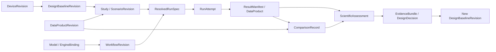
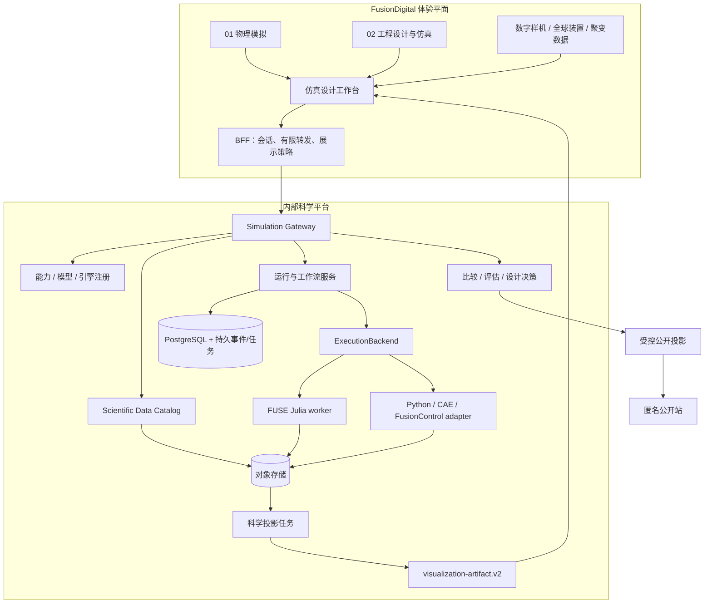

# 整体架构与领域决策

状态：评审稿 v0.1；与[文档入口](README.md)共同解释。所有未注明“现有”的模块均为拟建设。

## 1. 用领域能力组织产品

建立六层映射，避免功能、软件和运行环境混成同一个对象：

| 层 | 回答的问题 | 示例 |
| --- | --- | --- |
| Domain | 属于哪个专业模块 | `physics`（01）、`engineering`（02） |
| Capability | 用户要做什么 | 平衡分析、输运预测、径向构型设计、线圈载荷分析 |
| ModelDefinition | 用什么物理/工程假设 | 某平衡方程、降阶输运闭合、薄壳应力近似 |
| EngineImplementation | 哪份程序实现它 | 固定版本 FUSE.jl、自研 Python 实现、其他 CAE 适配器 |
| ExecutionBackend | 在哪里怎样运行 | 单机隔离进程、Docker job、Slurm job |
| Data/Visualization Adapter | 怎样读写与呈现 | IMAS 文件映射、CAE 结果转换、Three.js/VTK 投影 |

一个引擎可实现多个领域能力；一个能力可有多个数学模型和引擎实现。语言从 Julia 改为 Python 是实现版本变化；数学假设变化是模型版本变化，两者必须分别记录。

`IntegratedDesignStudy` 的 `domainIds` 初期固定允许 `physics`、`engineering`，其中一个为主域，另一个可关联。未来根据真实业务增加其他域。09 总体集成仍负责全厂/生命周期集成知识与跨系统业务，不因存在工作流编排器而接管物理和工程能力。

### 首批能力目录

| ID 示意 | 主域 | 用户输入与输出 | 初期供给策略 |
| --- | --- | --- | --- |
| `physics.forward-equilibrium` | 01 | 边界/电流/剖面 → 前向平衡、磁通、q | 按 adapter 核验可用模型 |
| `physics.equilibrium-reconstruction` | 01 | 诊断观测/误差模型/先验 → 逆问题平衡重构 | 独立输入、算法与逆问题证据 |
| `physics.core-transport` | 01 | 剖面/源/边界 → 通量、更新剖面、残差 | FUSE demo 为首批接入候选 |
| `physics.sources-current` | 01 | 加热/电流驱动方案 → 源和电流分量 | 有数据、依赖和测试后启用 |
| `engineering.radial-build` | 02 | 几何/厚度/约束 → 构型和裕量 | 优先离线导入或受控模板 |
| `engineering.magnet-loads` | 02 | 电流/几何/材料/载荷 → 力、应力、约束 | 近似模型与有限元分别注册 |
| `engineering.thermal-neutronics` | 02 | 功率/材料/网格 → 热载荷/中子相关结果 | 独立验证和数据就绪后启用 |
| `integrated-design.trade-study` | 01+02 | 设计变量/目标/约束 → 可行设计集 | 组合 capability，不指定某一引擎 |

表中表示平台需要容纳的任务类别，不是对当前 FUSE demo 能力和保真度的认证。`result-replay` 是已存结果读取/展示模式，不授予某引擎前向或重构能力。`availability` 分为 `catalog-only`、`offline-results`、`runnable`、`retired`；可运行性由已注册 binding、依赖和资源共同决定。

## 2. 统一数字线程

设计候选、仿真结果、实验事实和被批准的设计基线各有身份。某次优化得出的参数不会自动改写装置主数据或设计基线；接受候选通过新的 DesignDecision 产生新版本，并保留原始证据。

DesignBaseline 至少聚合装置几何、材料集、载荷工况、需求/约束、边界条件和参考数据版本。物理侧与工程侧通过同一个基线识别“究竟在算哪个设计”。参数名相同不意味着两次研究在相同几何、材料或磁场约定下可比较。

## 3. 系统边界

计算运行和可视化运行是独立生命周期。终态 ResultManifest 封存原生/规范科学结果，之后生成的展示通过独立 ProjectionBinding 引用它，不能回写旧结果。求解已完成而 ParaView 会话暂时不可用时，运行页仍可显示指标与证据；渲染崩溃不会重跑求解器。Blender/OpenUSD 发布是转换/制品活动，沿用既有开放可视化边界。

Gateway 初期为 Python 模块化单体，内部按 Catalog、Study、Run、Artifact、Comparison、Assessment、Publication 分包。worker 独立进程/容器。先用一个 PostgreSQL 保存科学元数据及持久任务/事件，用事务 outbox 和带租约的任务表连接调度；不引入第二份队列事实源。Redis、NATS、Temporal、Kubernetes 按经测量的需求后加，接口从首期保留。

FUSE 的 Julia 运行不进入 npm、浏览器或 Worker 构建。Web BFF 是可移植 HTTP 边界，既适用于 vinext 部署，也适用于 Sites Worker；这不要求所有内部科学访问必须经过公网 Sites。内部研究环境可以独立部署同一 Web 产品并连接内部 Gateway。

## 4. 计算、数据和可视化三条接入链

| 接口族 | 责任 | 不承担的责任 |
| --- | --- | --- |
| EngineAdapter | 能力声明、配置转换、求解协议、输出解释 | 决定访问权限、任意读宿主文件、自动选择科学上等价模型 |
| ExecutionBackend | 启停、资源、进程/容器/调度 job 身份、超时和隔离 | 理解密度、热通量、COCOS 或科学收敛 |
| DataAdapter | 定位授权源、快照、格式读取、语义映射 | 提交求解、修改实验权威源、发布公开数据 |
| ProjectionAdapter | 将已封存科学数据生成轻量曲线/网格/展示制品 | 作为新实验真值、静默改变坐标或平滑后覆盖源结果 |
| AssessmentPlugin | 数值检查、比较、残差、守恒、UQ | 修改原始输出、将退出码零等同于验证通过 |
| Optimizer/Coupler | 设计变量、耦合求解、目标约束与迭代策略 | 取代基础设施队列或默认获得实时控制权限 |

这些是接口边界，不代表首期部署六套微服务。平台共享合同，允许每类实现独立版本化和更换。

## 5. 集成设计所需的科学机制

### 5.1 区分任务图与数值耦合

`WorkflowRevision` 外层表示可调度 DAG。存在物理—工程反馈时，建立一个 `CouplingGroup` 节点：在该节点内部用有状态迭代求解器处理环，外层 DAG 只看到组输入、状态和最终输出。

每个端口声明 quantity ID、量纲、位置/网格、时间语义、正方向、数据类型、required/optional 与支持格式。每条边固定 MappingRevision。仅凭变量名、数组长度或“都能读 HDF5”不得建立连线。

工作流提交时冻结外部输入、图、节点模型/实现、转换recipe及策略；尚未计算的上游输出只能以节点/端口引用表达。待上游结果封存后，协调器才用真实output digest解析下游child ResolvedRunSpec，再提交child attempt。不能为未来输出编造hash，也不能为了冻结整个工作流而要求所有结果提前存在。生成几何/网格的准备活动遵循同样规则，候选草稿经该活动解析后才得到完整DesignCandidateRevision。

CouplingSpec 明确：显式/隐式、顺序/并行更新、初始猜测、松弛策略、绝对/相对容差、尺度归一化、最大迭代、发散判定、失败政策。稳态闭合的迭代编号与物理时间分开，时间协同的同步窗与子步也分开。

FUSE 首次作为一个封装的集成节点运行，保留其内部 actor 调度和 `dd` 更新语义。actor DAG 初期是观测和证据视图；仅在输入输出和副作用已明确时才拆为平台可独立调度节点。不能直接将内部 actor 顺序转换成跨进程 DAG。

### 5.2 示例闭合链

外层设计优化：物理运行产出功率/电流/平衡 → 显式载荷映射 → 工程响应/约束评估 → 新设计候选 → 重新求解。内层 CouplingGroup 则在固定候选、材料定义和边界下，迭代场、温度、形变等耦合状态以达到方程闭合；迭代形变可以作为状态，但不能偷偷改变候选的设计变量。两层分别保存 iteration、预算、停止条件和失败原因。

每轮记录负载映射、材料版本、守恒误差和约束裕量。二维轴对称到三维表面映射必须声明旋转对称假设、面积权重、法向和映射后积分误差。

首个试验采用有解析参考的低成本两学科算例验证调度、单位和反馈收敛，再用经专业审阅的物理—工程接口替换。参考 [OpenMDAO 的两学科耦合案例](https://openmdao.org/newdocs/versions/latest/basic_user_guide/multidisciplinary_optimization/sellar.html)，不将其本身称作聚变验证。

### 5.3 设计空间、约束与不确定度

Study 定义连续/离散变量、界限、固定量、目标方向、约束表达式版本和计算预算。扫描/优化为每个候选生成不可变 DesignCandidateRevision，固定 parent baseline、参数 patch 和解析后的几何/材料/网格 hash，再绑定 ScenarioRevision 和 child run。接受候选才形成新的 DesignBaselineRevision，不覆盖单个“最佳参数”文件。

可行性、目标值和求解有效性分列。失败样本不自动填入巨大 penalty 冒充观测；优化器若采用 penalty，要记录政策版本、原因与原始缺失值。Pareto 集保留权衡和不确定区间；改变目标、权重或约束应创建新的 StudyRevision。

科学评估区分代码验证、数值验证、实验验证、适用域和不确定度；随机种子不能替代模型误差评估。每个能力声明能力相关指标，具体物理容差由专业负责人和基准集给出。

## 6. 代码与部署组织

| 代码边界 | 首期归属建议 | 发布物 |
| --- | --- | --- |
| 体验/UI/BFF/展示路由 | 现有 FusionDigital | Web release |
| 跨语言 JSON Schema/OpenAPI/测试向量 | 初期科学平台仓库 `contracts/`，只读发布给消费者 | 带 digest 的 contract bundle、TS/Python SDK |
| Gateway/科学目录/worker SDK/适配器 | 新的内部科学平台仓库，建议名 FusionCompute（待创建） | API/worker OCI images |
| FUSE 源码 | 保留独立上游 checkout 或受控 fork | 固定源码 SHA/Julia lock/镜像 |
| FusionControl | 保留独立仓库和领域 owner | 经适配的控制/plant 执行包 |
| 私有数据/模型/运行结果 | 数据目录和受控对象存储 | DatasetRelease / EvidenceBundle |

不把大型科学依赖树和运行数据合入 Web 构建；也不为了架构图立即拆出多个服务仓库。合并的是产品流程、领域引用和协议，代码按发布、许可和访问边界组织。新仓库尚未创建，其远端/访问策略在落地时配置；当前 FusionDigital 双远端和同 SHA 发布约束继续适用。

OCI是首期默认科学运行包，不是全部传统程序的强制发布格式；HPC允许SIF或可验证的原生executable/环境锁。RuntimePackage与ModelRevision、模型制品和RunSpec分离。详见[IMAS与传统栈](06-imas-and-legacy-interoperability.md)、[容器与执行后端](07-container-and-runtime.md)。

契约只有一个维护源：从 JSON Schema 生成 TS/Pydantic 类型，并将 generated code 标记为不可手改；业务层 Pydantic/服务规则补充跨字段、权限和科学语义校验。若生成器不覆盖所选 schema 特性，先收敛协议特性或写显式转换层，不能维护两份独立“真 schema”。

## 7. 主要架构决策记录

| ADR | 决策 | 代价与重审触发条件 |
| --- | --- | --- |
| ADR-001 | 01/02 领域 + 通用仿真工作台 + 可换引擎 | 目录需映射能力；第二引擎接入后复核抽象是否过窄 |
| ADR-002 | 中性元数据 envelope + 领域 semantic profile + 原生制品 | 多格式映射要验证；不建立覆盖全科学的单一巨大对象 |
| ADR-003 | Gateway 模块化单体、worker 独立 | 首期简单；独立团队/伸缩需求明确后拆服务 |
| ADR-004 | 运行、科学评估、发布三个状态体系 | UI 信息增加；避免错误的成功/高保真结论 |
| ADR-005 | 复用 visualization-artifact.v2 | 增加科学到展示的绑定校验；必要时以兼容变更补强展示合同 |
| ADR-006 | FUSE 集成节点先封装，actor 先观测 | 早期细粒度调度有限；取得稳定端口合同后再拆 |
| ADR-007 | 静态结果先行、第二实现同时验收 | 首期增加合同测试工作；显著降低供应商/语言绑定 |
| ADR-008 | 科学与 Web 独立发布，组合清单固定兼容版本 | 需要部署兼容矩阵；不强制所有仓库同一 tag |
| ADR-009 | 公开站只读投影；内部服务执行计算 | 内部入口需要单独接入；现有公开匿名合同不扩张 |
| ADR-010 | IMAS优先的物理语义 + 字段/版本/方向级兼容资格 + 原生资产保留 | 显式映射与迁移测试有成本；接入新DD/库/backend时重审 |
| ADR-011 | Docker/OCI默认包装，统一任务协议，保留多执行后端 | 需Runner和运行包合同；HPC/商业栈不强制改为Docker |

以上为本轮建议决策，状态 `proposed`。工程票据按其设计推进；真正协议冻结和科学资格发布以明确版本及评审记录为准。
