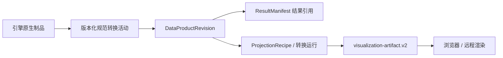

# 科学数据管理、版本与可复现性

## 1. 建立专门的科学数据模块

建立 Scientific Data Catalog，管理数据对象、精确版本、语义、血缘、权限和制品解析。它在产品上属于08数据基座的共享能力，由01物理、02工程及其他领域使用；工作台通过目录绑定输入和读取结果。

初期作为 Gateway 内部模块，避免一开始单独部署数据湖、图数据库和多套查询引擎。现有 MDSplus、IMAS 文件、CAD/CAE 档案继续保存各自权威来源；目录保存引用和明确的快照，不抢占装置事实维护权。

采用“中性公共元数据 + 领域 profile + 原生资产”：公共 envelope 只统一身份、schema、revision、digest、来源和访问；QuantityDescriptor引用物理量的精确领域字典定义并补充数据定位，工程网格等位于专门 profile。所有对象不强制顶层 `units/timebase`，避免给模型、研究或许可证填入没有含义的字段。

## 2. 核心对象与生命周期

| 对象 | 作用 | 版本/可变性 |
| --- | --- | --- |
| Study / StudyRevision | 研究问题、领域、变量、目标、预算 | 草稿可改；提交版本冻结 |
| DeviceRevision | 装置身份和权威机器描述引用 | 冻结版本 |
| DesignBaselineRevision | 几何、材料、工况、约束、设计决定 | 每次接受候选生成新版 |
| DesignCandidateRevision | parent baseline、设计变量patch、解析几何/材料/网格引用 | 每个优化候选冻结；接受后才形成新基线 |
| ScenarioRevision | 初态、边界、脉冲/载荷工况 | 冻结版本，无强制 Shot |
| WorkflowRevision / CouplingSpec | 能力、端口、映射、迭代与优化策略 | 冻结版本 |
| ModelRevision | 数学假设、适用域、参数化、模型卡 | 与软件实现分开 |
| EngineRelease / AdapterRelease | 程序、依赖、包装和输入输出映射 | SemVer/上游版本+内容 digest |
| DataProductRevision | 已登记科学输入或输出 | 原生与派生关系固定 |
| ResolvedRunSpec | 接受任务时全部已解析的计算意图 | 接受后不变 |
| SimulationRun / RunAttempt | 逻辑任务 / 一次执行 | 事件追加，状态查询投影可变 |
| RunManifest / ResultManifest | attempt 终态记录 / 精确输出集合 | 封存后不变；允许 partial |
| ProjectionBinding | 科学结果到展示制品及转换活动的绑定 | 独立追加；后发投影不修改原ResultManifest |
| ComparisonRecord | 多源比较与对齐活动 | 固定双方和方法版本 |
| ScientificAssessment | 运行结果的评估及允许用途 | 独立新记录，可重新评估 |
| QualificationRecord | 某实现对能力、装置范围和用途的资格 | 引用验证套件和结果；可撤销但不抹历史 |
| PublicationRecord / EvidenceBundle | 发布投影/可审阅证据包 | 新记录引用原结果与评估 |

`facility-record`、`simulation-run`、`comparison-record`、`design-asset` 保持独立 source kinds。版本化 ID 指对象内容；权限、撤销和保留政策是可更新控制元数据，不因数据 hash 未变化而永久授权。

## 3. Quantity、坐标、轴与工程语义

### 初始数据库结构与约束

以下是逻辑表组，P0再细化DDL；不是已实施数据库迁移。

| 表组 | 主键/索引与关键约束 |
| --- | --- |
| studies、study_revisions、analyses、scenario_revisions | `(project_id,id,revision)` 唯一；draft用version/ETag；冻结行禁止覆盖 |
| design_baselines、design_candidates、design_decisions | candidate固定parent和解析引用；接受decision产生新baseline |
| capabilities、model_revisions、engine_releases、engine_bindings | 稳定ID+release；能力多对多；精确兼容组合索引 |
| data_products、data_product_revisions、quantities、artifact_contents | 内容身份与revision；禁止同revision不同digest |
| artifact_placements、mapping_revisions、projection_bindings | locator独立于content；多representation有显式变换活动 |
| workflows、workflow_revisions、node_bindings | 固定图和recipe；child spec在上游封存后锁实际input digest |
| run_specs、runs、attempts、job_leases | run关联固定spec；叶子run最多一active attempt；stateVersion和fencing约束 |
| run_events、outbox、idempotency_records | `(run_id,sequence)`唯一；幂等key+request digest；状态/事件/outbox同事务 |
| result_manifests、comparisons、assessments、qualifications | 引用精确输入/结果/套件；重评新增，不回写原证据 |
| project_members、access_policies、publications、audit_events | 当前权限单独裁决；公开结果必须经过publication投影 |

跨项目引用必须有授权的sharing record，不能靠知道外部ID绕过项目边界。JSONB保存版本化配置和小型可扩展元数据，关键引用、状态、唯一性和关系用显式列/约束；数组和大日志不存JSONB。目录和展示查询可以缓存，但只能从规范记录/事件重建。

### 公共科学描述

每个 QuantityDescriptor 至少包含 `quantityId`、定义/字典版本、单位、dtype/endianness、dims/shape、axisRefs、association、validityRef、不确定度引用和数值数据引用。标量的 dims 为零维，不随意增加单元素时间维。

轴明确区分 `physical-time`、`shot-relative-time`、`radius`、`frequency`、`load-step`、`iteration`、`candidate-index`。相对炮次时间有 time-zero 定义和 shot 引用；频率标明 Hz/rad·s⁻¹；径向坐标标明定义。壁钟执行时间和科学时间分别记录。不同轴或采样率通过 Comparison/Mapping 显式对齐。

CoordinateFrame 定义长度单位、原点、轴方向、手性、基底、有效装置/几何 revision；TransformRevision 固定矩阵/非线性映射、输入输出 frame、适用范围和误差。刚体配准、网格插值、单位变化、COCOS 转换不是同一种变换，不压成一个未经解释的 matrix。

### 物理 profile

使用固定 [IMAS Data Dictionary](https://imas-data-dictionary.readthedocs.io/en/latest/intro.html) 版本映射已有 IDS、字段单位和坐标。记录 IDS path、occurrence、来源版本、缺失规则、磁通是总量还是除以 `2π` 的量、COCOS、场/电流正向、`rho_pol_norm` 与 `rho_tor_norm`、物种 Z/A/电荷态。

IMAS 是领域语义 profile 和交换路径；FUSE.jl 所采用的 IMAS 生态实现及其支持的读写格式必须实测，不能仅凭“IMAS compatible”就假设与任意 Access Layer 二进制文件互读。

DD版本、库版本、文件layout和backend分别锁定；FUSE扩展按字段核对，跨DD转换必须记录recipe与损失。IMAS Bridge及首期IDS/传统数据兼容套件见[06兼容设计](06-imas-and-legacy-interoperability.md)。IMAS包版本不等于ITER DD版本。

### 工程 profile

记录几何 revision、mesh topology/coordinates digest、部件稳定 ID 与分析网格映射、节点/单元/面/积分点关联、材料及温度依赖曲线、载荷/边界 ID、参考/变形构型。向量说明局部/全局基底；张量说明分量/Voigt 顺序及工程剪应变约定。

必须分别定义压力 Pa、热流 W/m²、体热源 W/m³、总功率 W、体力 N/m³、面力 N/m²和节点力 N。单位可转换、数组长度一致仍不证明端口可连。有限元工程数据无需硬塞进不合适的 IDS；可以保留原生 CAE/HDF5/XDMF/VTK 并绑定 EngineeringProfile。

CAD/GLB 的展示部件可用于选择，但求解必须引用经过资格检查的 solver geometry/mesh。装置几何 revision 更新会使旧网格、配准、载荷映射和部分验证资格失效，界面要列出受影响依赖。

## 4. 存储职责与格式协商

| 存储/格式 | 职责 | 首期策略 |
| --- | --- | --- |
| Git | 代码、小型 schema/样例、映射 recipe、评估代码 | 不保存运行大数组、环境缓存和私有装置输入 |
| PostgreSQL | 目录、对象引用、项目 ACL、研究、运行、事件、评估、血缘 | 关系表+有限 JSONB；科学数组放外部 |
| S3/OSS/兼容对象存储 | 输入快照、原生输出、模型权重、网格、封存清单 | adapter 封装 endpoint/version/retention 差异 |
| OCI registry | API/worker/引擎运行包 | image digest、平台架构、依赖清单 |
| MDSplus/既有档案/PLM | 实验/设计权威源 | 只读解析为授权版本快照 |
| HDF5/引擎原生格式 | 求解器兼容输入输出和完整科学记录 | 固定 writer/reader 版本并保留原始文件 |
| Zarr | 需要切片的多维数组 | 经过 Julia/Python/浏览器 reader 组合测试再选 version+codec |
| Parquet / Arrow | 大量标量、候选表、聚合指标 | 小规模先 JSON；不把运行状态事实改存列文件 |
| JSON / 小二进制块 | 浏览器摘要、少量曲线与投影 | 明确 MIME、shape、有效范围和 hash |
| D1 / 公共静态资产 | 现有账户/研究功能和允许的公开投影 | 不保存科学平台私有运行状态真值 |

DataAdapter 的可替换性包含 source catalog、snapshot reader、format converter 和 ArtifactStore。`DataProductRef` 使用 ID/revision/digest，不包含永久 endpoint。迁移存储改变 locator 和迁移记录；科学内容未变时保留内容身份。若发生压缩/重排/再编码，字节 digest 变化，创建新 representation 并验证数值一致性。

FUSE 接入初期选择一条实测通路：原生结果保留文件，adapter 输出小 JSON metrics/diagnostics；后续 exporter 增加平衡/剖面文件，再按前端需要生成受控切片。不要为了未来所有引擎，首期要求每个结果同时转成全部格式。

## 5. 原生、规范、投影的关系

终态 ResultManifest 只锁定 nativeArtifactRefs、dataProductRefs 和诊断输出。后发 ProjectionBinding 的逻辑形状为 `{resultManifestRef, dataProductRefs, visualizationArtifactRef, projectionRecipeRef, conversionActivityRef}`，引用必须含 revision 与 digest。封存时已存在的展示可以选填引用，后续重新生成则新增 binding，不回写旧 manifest。无需复制可视化协议的 deliveries/complexity/access 字段。

跨合同校验至少确保展示 `sourceRecord.id` 对应精确 run/comparison/design 记录；展示制品与 DataProduct 的 hash/转换活动可沿绑定链核对。现有 `sourceSha256` 只表达一个源摘要，多输入投影以显式 source manifest 的 digest 表示，不能选择任意一个输入冒充全链血缘。

现有 v2 的可选 hash/URI 不足以单独保证科学结果可封存。科学投影发布器使用更严格 validation profile；临时读取 URL 不进入内容哈希。必要的 schema 增强遵循兼容矩阵并单列变更，不另造展示 router。

压缩、简化、重采样、插值、单位/坐标变换都记录 recipe/version/输入输出 digest、误差或损失说明。经降采样的浏览器投影不自动获得 solver-input 资格。OpenUSD 继续表达场景组合和引用，不能代替字段、网格、材料与原始科学数据。

## 6. 缺失、部分结果与质量

JSON 非有限值转换为 null 并保留 `reason`；二进制数据使用有效性 mask 和已完成区间。原因至少区分 `not-computed`、`missing-input`、`failed-step`、`outside-domain`、`nonfinite`、`not-exported`、`not-applicable`；访问被拒绝属于授权响应，不伪装成科学零值或泄露对象存在性。

[Zarr 核心规范](https://zarr-specs.readthedocs.io/en/latest/v3/core/)有 fill value 和未存储块语义。平台不能把缺块默认值理解为真实计算结果，必须保存完整块清单、已计算 extent 和 validity mask；读者验证某个零值究竟是有效结果还是未计算区域。

源 authority、modelClass/fidelity、execution status、scientific status、review/publication status 分开。一次 `simulated` 数据产品可以来自 surrogate 模型；一次失败运行可以产生对诊断很有价值的 partial DataProduct。原始失败记录不因后续重试成功而删除。

## 7. 内容身份与封存协议

1. 接受运行前解析 aliases，固定输入 DataProduct、模型、实现、映射和策略，生成 ResolvedRunSpec。
2. worker 以 attemptId 和 fencing token 写入隔离 staging prefix；每个文件/块记录字节数、hash、完成情况。
3. collector 校验 schema、引用、变量描述、文件 hash、实际完成范围，形成 candidate ResultManifest；partial 是有效的显式状态。
4. 文件写入不可覆盖对象版本或内容地址。对象存储没有通用目录 rename/跨库事务，采用“对象先存在，元数据事务后登记”的顺序。
5. Gateway 用当前 fencing token/CAS 在一个数据库事务中登记 Manifest、DataProduct、终态事件和 outbox；只有 committed manifest 对读者可见。
6. 若崩溃发生在对象写入后、登记前，reconciler 识别 orphan；若登记后投递失败，outbox 重放。staging/orphan 根据保留政策延迟回收，首期只报告候选，不自动删除未知资产。

JSON canonical digest 采用明确版本的 [RFC 8785 JCS](https://datatracker.ietf.org/doc/html/rfc8785) 实现并跨 TS/Python 测试；hash payload 排除自身 digest、签名、临时 URL 和可变访问元数据。禁止重复 key，时间格式和 ID 使用规范编码，大整数 ID 用字符串，NaN/Infinity 不进入 JSON。科学高精度数组不强制降为 JSON 双精度。

多对象数据集用排序的 `{logicalPath, bytes, sha256}` 内容清单及其 root digest。provider、locator、objectVersion 进入单独版本化 PlacementRecord，不参与科学内容摘要；迁移存储可以保留内容身份。对象储存 ETag 不一概视为 SHA-256。内容摘要证明校验一致性；抵抗管理员修改还需对象版本保留/锁定、签名、外部封存等。时间戳加 hash 本身不等同 WORM。

内容哈希引用图须无环。DataProduct 的生成来源先绑定稳定 runId/attemptId/activityId；终态 manifest 再通过 digest 锁定输出，反向血缘关系保存在索引中。不能要求每个输出同时引用尚未生成的最终 manifest digest，形成循环哈希依赖。

## 8. 多维版本管理

| 版本轴 | 精确锁定 | 变化后要做什么 |
| --- | --- | --- |
| API / contract | major/minor + schema bundle digest | 兼容测试与 SDK 生成 |
| quantity/profile 字典 | profile revision/digest | 语义差异评估，不能只看 JSON 结构 |
| 设计/场景/工作流 | revision+content digest | 新 run；依赖变更影响图 |
| 数学模型 | 方程/假设/模型卡 revision | 重新评估适用域与资格 |
| 引擎源码 | upstream tag+完整 SHA+patch digest | 构建与回归；不是只存 version string |
| 运行环境 | RuntimePackage digest（OCI/SIF/原生环境锁）+OS/arch+runtime | 比较编译器/MPI/驱动/硬件影响，非容器路径也须精确锁定 |
| adapter/mapping | release+digest | 转换/错误语义和端口测试 |
| 权重/材料/数据库 | 制品 digest+来源 revision | 新科学输入/适用域评估 |
| 数值/耦合/优化 | solver config、容差、seed、策略版本 | 新 run，不能作为隐藏 retry |
| 评估/数据集划分 | suite+calibration/validation/holdout refs | 新 Assessment，不修改旧结论 |
| 投影/渲染 | recipe+展示制品 hash、renderer release | 科学数据不变可重生成展示 |

schema SemVer 与对象 revision 分开。结构可兼容的单位/符号含义变化也可能是科学破坏性变更，必须升级 semantic profile 和 mapping。不要静默把旧结果迁移覆盖为新解释；保留原 representation，增加转换活动和新版本。

ResolvedRunSpec 包含精确 EngineBinding：capability/model、engine/adapter、输入 profile/mapping、runtime environment、output profile、assessment suite。`latest` 可用于目录推荐，不能保留在提交后的锁文件中。上游分支本身不是运行版本。

镜像不作为模型/数据的唯一版本号：权重、材料、校准、场景与输入各有独立digest。改变参数不要求重建镜像，但产生新RunSpec；改变实现/环境需新RuntimePackage与兼容评估。[容器与运行包](07-container-and-runtime.md)规定对应边界。

## 9. 发布组合与升级回退

建立 PlatformReleaseManifest，固定 Web SHA、Gateway image、contract bundle、数据库 schema version、允许 engine/adapter bindings、projection recipe 和评估套件。Web 两个公开发布目标仍按现有合同同 SHA；科学服务有自己的版本，组合清单声明已测试兼容关系。

数据库使用 expand → migrate → contract；新增读者先双读或显式转换，随后升级 writer，确认旧客户端窗口关闭后才移除旧字段。应用回退不盲目执行破坏性 DB downgrade。部署前验证组合清单，运行时拒绝不受支持的 profile/major。

引擎升级以新 release 并存，完成资格后调整可变推荐 alias；历史运行仍引用旧 digest。上游 FUSE 更新只导入独立分支/镜像，先审查差异和依赖，再跑 adapter/模型回归。自有修订单独 fork/patch 发布，不能只改工作目录却沿用上游版本号。

## 10. 可复现性、缓存、恢复与保留

复现分三级声明：字节一致、指定容差内数值一致、统计性质一致。记录 JIT/warm-up、正式计算、导出分别耗时；GPU/线程/随机算法/硬件可能影响结果，不能用一次相同 seed 承诺跨环境逐位一致。

HTTP 幂等键防止重复创建；科学缓存键决定能否复用。缓存键包含解析后输入、模型/实现、adapter/mapping、耦合/数值参数、seed、环境要求和输出 profile。缓存命中仍需当前项目权限和质量资格；非确定性或未评估结果默认禁自动复用，跨租户不能仅凭 hash 共享。显式重跑不被缓存策略吞掉。

备份涵盖 PostgreSQL、对象版本、镜像/锁定源码、密钥恢复程序和发布组合清单。恢复演练必须验证元数据所引用的每个保留制品存在、hash 匹配、权限和读取仍正确，不能只恢复 SQL。

初期保留政策按输入权威、封存科学结果、临时投影、日志和 staging 分类；输入与被证据引用制品设 reference hold。具体天数和预算由运行 owner 配置，不能默认全永久或自动清除失败结果。所有清理先按精确对象集合和引用检查执行，撤销公开投影只改可访问性、不伪改历史结果。

## 11. VVUQ、比较与研究对象导出

ComparisonRecord 固定双方 source refs、设备/工况、相对时间/坐标变换、插值和窗口策略、指标定义、误差模型以及排除项。未经映射的结果可以并排看，但不能直接生成差值。标准化残差须在独立性/协方差假设成立时定义，缺少误差时只报原量纲残差。

ScientificAssessment 分别保存 code verification、solution verification、experimental validation、applicability、measurement/parameter/numerical/model-form uncertainty。每项是 `not-assessed / incomplete / failed-criteria / passed-criteria / inconclusive` 及证据引用。通过某套测试只适用于指定能力/装置/参数域/用途，不自动获得所有用途资格。

血缘采用 [W3C PROV](https://www.w3.org/TR/prov-overview/) 的 Entity/Activity/Agent 关系映射到关系表：输入 used、输出 generated、数据 derived、执行 associated。首期无需 RDF/图数据库。长期归档/合作方交换需要时再生成 [RO-Crate](https://www.researchobject.org/ro-crate/specification/1.2/)；先完成可导出的清单、schema、软件环境、输入输出引用和限制说明。

采用 xarray 等带名称数组工具能改善 Python 开发，但其 attrs 不自动验证单位、坐标和物理定义；独立语义校验仍是平台责任。见 [xarray 数据结构说明](https://docs.xarray.dev/en/stable/user-guide/data-structures.html)。
