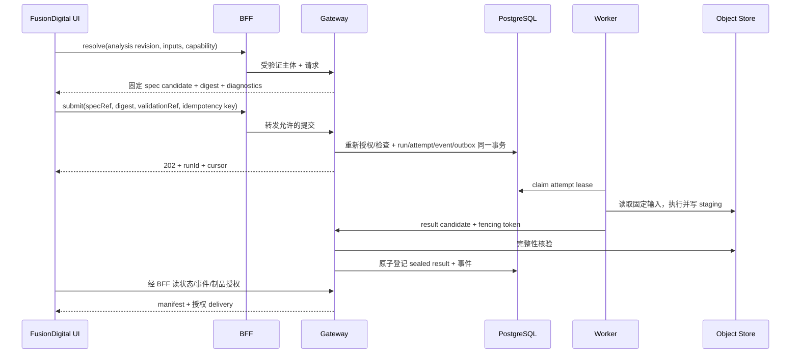
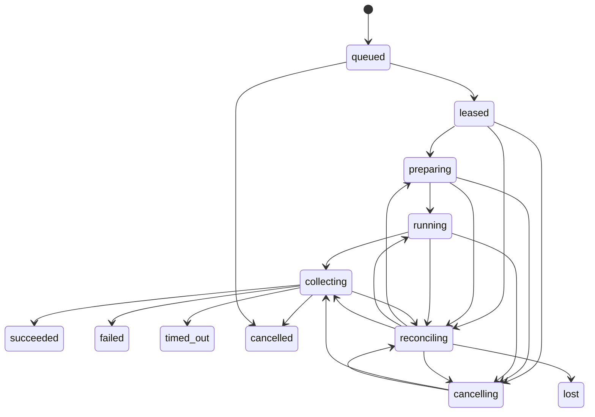

# 计算引擎接入、前后端 API 与运行协议

## 1. 两个 API 边界

FusionDigital 浏览器调用同源 `/api/simulations/v1/...` BFF；BFF 只代理到配置中注册的 Gateway。内部 Gateway 暴露 `/v1/...`。认证部署可通过用户主体映射访问内部项目；公开匿名构建只提供审核投影的有限读取，不能因为新增路由就开放计算写 API。

既有 `app/api/research/runs` 管理资料采集/研究候选，不能复用为科学运行表。HTTP 错误、请求 ID 和审计习惯可以复用，模型与数据归属独立。Gateway 再做资源级授权；浏览器传来的 projectId/userId 不构成身份。

身份桥接采用短期、受众限定的服务令牌及受验证的用户主体映射；D1 账户不自动成为科学项目成员。开发初期可用受限本地主体启动闭环，生产接入既有企业身份时再配置 issuer/audience、项目成员和角色。密钥、对象存储永久凭据和内网原始端点不返回浏览器。

## 2. 拟实现接口目录

| Gateway 接口 | 语义 | 主要返回/限制 |
| --- | --- | --- |
| `GET /v1/capabilities?domain=physics` | 领域能力目录 | availability、schema refs、模型/输出 profile |
| `GET /v1/models/{id}/revisions/{rev}` | 数学模型定义 | 方程/假设/适用域/资格引用 |
| `GET /v1/engines/{id}/releases/{release}` | 软件实现描述 | capabilities、adapter、runtime/format 支持 |
| `GET /v1/compatibilities` | 可用 EngineBinding | contract/profile/runtime/资格精确组合 |
| `POST /v1/studies` | 新建研究草稿 | studyId、revision、ETag |
| `GET /v1/studies`、`GET /v1/studies/{id}` | 研究列表/详情 | 授权分页、草稿及冻结版本引用 |
| `PATCH /v1/studies/{id}/draft` | 编辑草稿 | `If-Match`；冲突 412 |
| `POST /v1/studies/{id}/revisions` | 冻结研究版本 | immutable StudyRevision |
| `POST /v1/scenarios/{id}/revisions` | 冻结工况 | geometry/material/input refs |
| `POST /v1/scenarios`、`GET /v1/scenarios/{id}` | 创建/读取场景 | 草稿编辑同样使用ETag |
| `POST /v1/designs/{id}/revisions` | 新设计基线/候选版本 | 变更来源和 DesignDecision 引用 |
| `POST /v1/designs`、`GET /v1/designs/{id}` | 创建/读取设计上下文 | baseline/candidate精确引用 |
| `GET /v1/data-products/{id}/revisions/{rev}` | 取科学描述 | profile、变量、权限允许的制品引用 |
| `POST /v1/data-imports` | 登记授权来源/上传会话 | 白名单 source ref；进入隔离校验 |
| `POST /v1/run-specs/resolve` | 解析、检查计算方案 | 固定 spec candidate、diagnostics、validationRef |
| `POST /v1/runs` | 接受并排队运行 | 202、runId、state、event cursor、Location |
| `GET /v1/runs/{id}` | 当前查询投影 | 状态、attempt、评估、result refs、updatedAt |
| `GET /v1/runs/{id}/attempts` | 历次执行 | job 身份的允许投影、失败/资源/环境 |
| `GET /v1/runs/{id}/events` | SSE 或事件分页 | 单 run 递增 sequence、可恢复游标 |
| `POST /v1/runs/{id}/cancel` | 持久取消意图 | 202 pending；终态规则见下 |
| `POST /v1/runs/{id}/retry` | 同 spec 新 attempt | 只在冻结的 retry envelope 内 |
| `GET /v1/runs/{id}/results` | 已封存结果 | complete/partial、manifest refs |
| `GET /v1/artifacts/{id}/revisions/{rev}/manifest` | 元数据/完整性信息 | 不返回永久私有 locator |
| `POST /v1/artifacts/{id}/read-grants` | 获得有限读取权限 | 短期、对象版本/操作/期限限定 |
| `POST /v1/comparisons` | 固定输入和对齐，创建比较任务 | comparisonId + activity/run ref |
| `POST /v1/assessments` | 指定结果与套件评估 | assessmentId + activity/run ref |
| `POST /v1/publications` | 创建审核投影候选 | 引用精确证据和白名单 recipe |
| `POST /v1/visualization-sessions` | 可选远程查看会话 | 仅授权制品、受控 session/期限 |

P1 只实现静态读合同；P2 实现基础研究/导入/resolve/run/result；比较和发布按票据逐步补齐。模型目录/研究接口使用稳定分页和过滤；列表按授权后过滤，不先全量泄露对象再在浏览器隐藏。

API 错误采用统一 Problem shape：`type/code/title/status/detail/requestId/fieldDiagnostics/retryable`。结构错误422、语义或绑定冲突409/422、草稿并发412、服务容量429、暂不可用503。无权访问对象采用项目一致的不枚举策略。detail 是脱敏摘要，原始科学日志位于有权限的制品。

## 3. 提交交互与冻结点



resolve 固定 aliases、模型、映射、运行包和输入，形成不可变 spec candidate。validationRef 带检查版本与有效期，但不是永久授权。submit 必须核对 candidate digest、当前权限、输入可读性和资格是否已撤销；若依赖条件已变化返回 `PREFLIGHT_STALE`，用户看到差异后重新 resolve。提交不会静默换引擎或改参数。

示意请求（只展示字段形状，不是可运行实例；`<...>` 必须由真实注册对象解析）：

```json
{
  "resolvedSpecRef": {"id": "<spec-id>", "revision": "<revision>", "digest": "<sha256>"},
  "validationRef": "<preflight-result-id>",
  "projectId": "<authorized-project-id>"
}
```

ResolvedRunSpec 的必需分组：identity/schema、Study/Analysis/Scenario/Design refs、domainIds、capability/model refs、EngineBinding、输入 DataProduct/Mapping refs、参数及单位、Workflow/Coupling refs、输出 profile、评估 suite、资源/超时/retry envelope、seed/确定性要求。engine native config 可作为 namespaced artifact 保存，但不是 React 的公共状态。

幂等唯一键采用 `(projectId, principalId, operation, idempotencyKey)`。先认证并检查当前资源访问权限，再查询既有key；相同 key+相同规范请求 digest 且已接受，返回原响应，不重新执行首次提交的preflight过期检查。只有尚未接受的新请求才执行上述重新预检；相同 key+不同内容409。访问被撤销时拒绝并避免泄露旧run。持久幂等记录在已发布保留窗口内有效；创建 run 的 request identity 随 run 保留，窗口外行为必须明确。科学缓存与该键完全独立。

## 4. 运行、执行和评估状态

SimulationRun 是逻辑任务，关联固定 spec、多个 attempts 和已选择 result ref；一次运行的 summary 是查询投影。每个 RunAttempt 的执行状态如下：



图是主要路径；启动失败进入 collecting 收集失败证据后 failed；无制品也可生成空输出诊断 manifest。collecting 保存引擎退出结果，因此 exit≠0 的执行仍能收集 partial outputs。queued/leased 等阶段被取消时同样保留事件。reconciling 根据真实job/收集状态恢复到相应阶段，始终保留cancel/deadline意图，不能无条件回running。

分别配置execution deadline、termination grace period和collection timeout。执行超时先停止并确认job，再收集并以timed_out结束；若结果收集超时则报告COLLECTION_TIMEOUT和原execution outcome，不能把“计算已结束但收集未完成”误报成数值超时。完整性失败保留独立reason。

三条状态轴分别读取：

- 执行：queued/running/collecting/succeeded/failed/cancelled/timed_out/lost 等。
- 科学：not-assessed/incomplete/failed-criteria/passed-criteria/inconclusive；含套件和用途。
- 治理：draft-review/reviewed/rejected/published/revoked 等独立记录。

`succeeded` 表示执行与结果登记按合同完成，不代表方程有效、数值收敛或实验验证通过。`lost` 表示协调后仍无法确定运行结果；保留 `runtimeStatusUnknown`，不能因此断言旧进程已停止。内部原子运行、workflow 子任务、Study 的聚合状态分别给出，不把某个 child 成功当整个研究成功。

常见 reason codes：INVALID_INPUT、INCOMPATIBLE_PROFILE、AUTHORIZATION_REVOKED、IMAGE_UNAVAILABLE、DEPENDENCY_MISSING、OOM、ENGINE_EXCEPTION、NUMERICAL_NONCONVERGENCE、OUTPUT_INTEGRITY_FAILED、TIMEOUT、WORKER_LOST、CANCELLED_BY_USER。科学不收敛记录在 assessment/diagnostics；若引擎以异常退出，还同时保留原执行失败。

## 5. 投递、租约、恢复与取消

任务投递采用 at-least-once。PostgreSQL 内状态变更、事件 sequence 和 outbox 同事务提交；dispatcher/worker supervisor 通过最小队列表权限claim工作。引擎子进程及第三方科学插件不持有数据库凭据。每次重新认领使用单调递增 fencing token，Gateway 只接受当前 token 的状态/结果提交。

ExecutionBackend job 使用 attemptId 作为稳定 label/name，submit 必须能查询已存在 job，防止“启动成功但回执丢失”再次启动。reconciler 先查询运行时真实状态，再接管或补收集。租约过期不自动杀进程，也不保证只有一次物理计算；fencing 保证过期 worker 不能污染规范结果。只有确认旧 job 结束/被隔离，或显式重复计算政策允许，才能生成替代 attempt。

取消意图先入数据库并阻止新的 attempt，再请求整个 job/process group 停止；先 grace period、再强制终止、确认状态、最后收集部分制品。取消与 sealed success 用同一状态版本/CAS 裁决：成功登记先完成则返回已完成；取消先被接受则停止成功晋级路径，收集结束后 cancelled。未确认进程结束保持 cancelling/reconciling，不提前显示已取消。

自动 retry 只处理冻结政策允许的基础设施故障，有次数、退避和总预算上限。retry仅对政策允许的终态失败attempt、预算仍有余量且不存在持久cancelIntent的run生效；取消过的run重跑须clone为新run。retry创建与cancel写意图使用同一run stateVersion/CAS，每个叶子run最多一个有效active attempt。Workflow并行节点使用独立child run，不与该约束冲突。

改变科学容差、模型、网格、seed、输入或超出资源环境 envelope 属新 run；不得默默调整至得到漂亮结果。retry 创建新 attempt，原失败制品保留。

checkpoint/resume 仅在 EngineDescriptor 声明且兼容测试通过时启用。checkpoint 包含引擎/模型/环境/输入/网格/状态 digest，新 attempt 引用它；不支持回滚的引擎不能通过加一个 HTTP endpoint 获得时域隐式协同资格。

## 6. 事件、日志和科学数据传输

SSE 事件 envelope：`schema/eventId/runId/attemptId/sequence/type/occurredAt/stateVersion/payload`。sequence 由 Gateway 分配，是 run 范围内顺序；producer 时间仅作时间证据，不决定顺序。客户端以 eventId/sequence 去重，Last-Event-ID 续传；游标超出保留范围返回 snapshot 和新 cursor。

事件类型限定为 state-changed、stage-changed、progress-reported、diagnostic-summary、artifact-sealed、assessment-ready、heartbeat 等。日志通过受控分页/制品读取，不能把 traceback、内部地址、环境变量直接广播。科学数组通过按制品/切片授权的对象读取或服务端投影，不走 SSE。

WebSocket 只在真实交互/远程渲染需求下采用，不承担通用科学时间步耦合。前端断线时作业继续；短期制品 read grant 过期可重新授权，不能使用 token 过期作为重算理由。

## 7. 插件协议与责任分离

对外统一运行接入面保留 `describe / validate / submit / status / cancel / collect / health`。内部实现分开：

| 协议 | 方法组 | 测试重点 |
| --- | --- | --- |
| EngineAdapter | describe、validate、prepare、execute、collect、optional checkpoint/resume | 科学参数、固定文件包、输出/异常含义 |
| ExecutionBackend | capabilities、submit、inspect、requestStop、reconcile | job identity、资源、取消/恢复、隔离 |
| DataAdapter | describe、resolve、snapshot、materialize、transform | 固定数据版本、格式/语义、只读与哈希 |
| ArtifactStore | putStaged、statVersion、readVersion、commitReference、issueReadGrant | 版本不可覆盖、完整性、权限/过期 |
| ProjectionAdapter | describeProfiles、convert、validateProjection | 科学源绑定、降采样损失和展示合同 |
| AssessmentPlugin | describeCriteria、assess、exportEvidence | 独立测试判据、局限和可追溯结论 |

权限由 Gateway/目录统一裁决，插件不通过自己的随意 `authorize()` 绕过平台。适配器接受 EngineExecutionContext 和只读输入包、只写输出 sandbox；没有数据库业务管理员权限。插件注册只能引用平台维护者构建/登记的包，普通用户不能上传可执行 adapter。

### EngineDescriptor 与兼容协商

必需字段：engineId/release、source digest、language/runtime、adapter/API/profile ranges、capability bindings、input/output ports、parameter schema refs、supported modes、资源档位、external dependencies、cancel/checkpoint 支持、确定性条件、验证套件与 qualification refs。

连接端口时先匹配 quantity/位置/轴/参考系等语义，再匹配 serialization profile；需要转换时插入显式 MappingActivity。兼容矩阵固定 contract、capability profile、model、engine/adapter、数据映射、OS/arch/accelerator、output profile、评估套件。未知 required feature 拒绝；可选展示字段可以按声明降级。

运行兼容性/数据合同/访问门禁与科学用途资格分开：前者是提交硬门槛；后者未取得时，只能在项目政策允许的探索/验证模式运行，明确标记unvalidated及用途限制。资格撤销按所请求用途重查，不能让用户通过改标签绕过禁用配置，也不能要求先完成实验验证才允许执行验证任务本身。

首期默认DockerBackend和每attempt独立batch容器；镜像内只需受控CLI/文件包，不要求每个引擎自建HTTP服务。EnginePackage、运行包/模型分离、warm service和非Docker路径见[07运行设计](07-container-and-runtime.md)。IMAS Bridge、精确DD和传统读写接口见[06兼容设计](06-imas-and-legacy-interoperability.md)。两者分别验收，镜像能启动不能自动得到IMAS互操作资格。

## 8. FUSE 首个 adapter

FUSE.jl 当前代码核验为 `9ef2f99af73497706a097d99a2aaac2f08405370`，干净；这只是接入候选源码基线。本轮未运行或重验科学结果。

首期 adapter 固定精选 case 与 actor profile，将领域输入转换为 `ini/act/dd`，在独立 Julia worker 内执行，输出原生证据和规范 metrics/diagnostics。引擎内部 actor 的版本、实际启用模型和收敛信息放 engine trace。FUSE 官方定义见 [基本概念](https://fuse.help/dev/)。

现有 `finalize_fpp_demo.jl` 拒绝未收敛结果；平台 collector 需独立实现，能保存失败/未收敛/超时/部分输出，不以 demo finalizer 成功作为唯一导入入口。将旧结果导入视为 import activity：保留源 hash 和已有证据，未知环境或输入标 unknown，不补造历史版本。

后续 exporter 逐 profile 增加平衡/剖面/工程量；每项以原生数值核对单位、符号、轴和有效范围。不要直接 serialize 整个可变 Julia 对象给浏览器，也不运行不可信 Julia serialization/Python pickle 上传内容。

上游 FUSE 内部数据模型可以保留；平台只依赖公开 EngineBinding 和科学 profile。更换引擎时，研究的科学意图保持，EngineBinding/ResolvedRunSpec 和可能的映射产生新版本。

## 9. Python 和其他引擎的演进路线

1. **Python 管理层**：Gateway、SDK、数据/投影/评估 adapter 使用 Python，FUSE 内核留在 Julia worker。可尽快统一运维与前后端接口。
2. **能力级替换**：为一个小而明确的数学核注册 Python implementation，使用同一能力 profile 和结果合同；不要求复刻全部 FUSE actor 类。
3. **并行资格验证**：解析/制造解、守恒、正常与病态输入、跨实现差异、网格/时间步敏感性、异常/取消和资源测试。旧 FUSE 不是绝对真值；无法判别时保留 inconclusive。
4. **逐能力切换**：新的 QualificationRecord 固定装置、范围、用途和容差；切换目录推荐 binding，旧 release、数据与结果继续可读。模型假设改变时升级 ModelRevision，而非声称纯语言迁移。
5. **外部求解器**：Fortran/C++/商业 CAE/FusionControl 等遵守相同 bundle/profile；环境、许可证资源和部署访问独立登记。

前端不因 Python 替换更改主路由、研究对象、运行状态或基础 renderer；新增专有输出需要新 output profile 和可选 viewer 插件，不能假装未知物理场已有通用解释。引擎退役必须保留中性导出和离线结果浏览，重算不可用时准确报告。

## 10. 哪些科学机制何时引入

| 机制 | 首期决定 | 升级触发 |
| --- | --- | --- |
| JSON Schema/OpenAPI + generated SDK | 立即采用并固定版本 | 多语言消费者共同合同测试 |
| 领域语义字典/单位/轴/网格映射 | 立即采用 | 新领域增 profile，不重写全平台 |
| 耦合残差/守恒/VVUQ | 首个真实耦合前落实 | 专业阈值随用途/基准版本冻结 |
| OpenMDAO 等多学科框架 | 先保留 Coupler 接口 | 真实反馈/导数/优化需求通过试验后选型 |
| FMI/SSP | 不作为普通 batch job 强制协议 | 外部动态模型需共仿真及稳定组件组合时试点 |
| gRPC/Arrow Flight | HTTP+对象包先行 | 实测高吞吐/低延迟服务边界出现时采用 |
| Slurm/K8s/专业工作流服务 | ExecutionBackend 预留 | HPC接入/多节点配额/长事务补偿需要时采用 |
| PROV/RO-Crate | 先血缘关系和证据包 | 合作方交换/论文归档时导出标准包装 |

[FMI 3.0.2](https://fmi-standard.org/docs/3.0.2/)区分 Model Exchange、Co-Simulation、Scheduled Execution。它可约束动态模型交换，不替代任务授权、排队、结果存储或自动提供硬实时保证。时域协同的时间步、rollback、事件和数值稳定性由专门 coupler 实现，与 Web 请求解耦。

## 11. 通用平台的完成证明

使用同一科学 profile，由 FUSE producer 和独立 Python 参考 producer 分别输出可读取结果；使用两种 ArtifactStore/DataAdapter 测试实现验证中性引用；移除 FUSE 运行环境后历史结果仍可查看/比较/导出。

参考 producer 是合同/解析测试实现，必须标明 SYNTHETIC 或相应科学来源；它证明接口可替换，不证明所有专业求解器兼容。真实第二引擎接入仍需科学资格验证。
